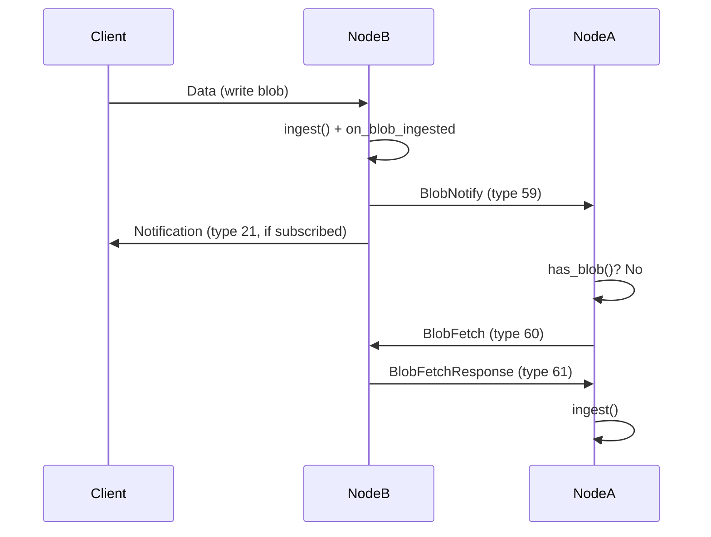
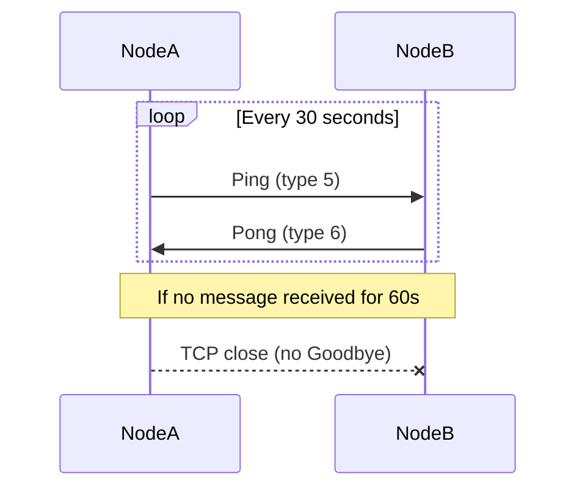
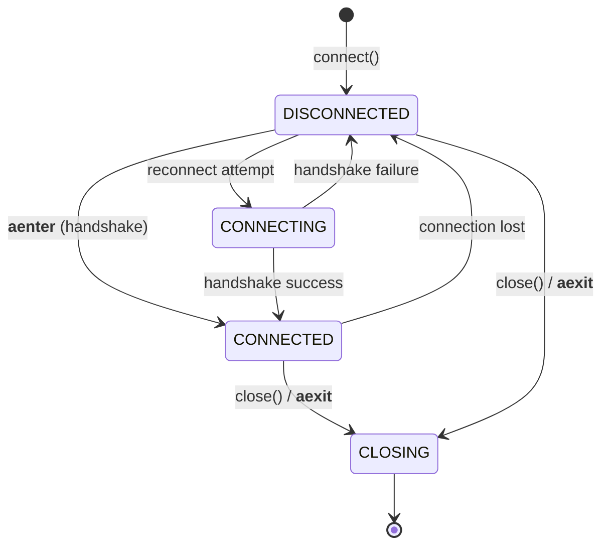

# Phase 85: Documentation Refresh - Research

**Researched:** 2026-04-05
**Domain:** Technical documentation (Markdown, Mermaid diagrams, protocol specification, SDK API reference)
**Confidence:** HIGH

## Summary

Phase 85 updates four documentation files to accurately describe the v2.0.0 event-driven sync model built in Phases 79-84. The four targets are: PROTOCOL.md (full restructure around connection lifecycle with byte-level wire formats for three new message types), root README.md (expansion from 15-line stub to full project overview), SDK README (auto-reconnect API documentation), and getting-started tutorial (connection resilience section).

This is a pure documentation phase -- no code changes. All source-of-truth information exists in the codebase: wire formats in peer_manager.cpp, SDK API in client.py and _reconnect.py, and configuration in config.h. The challenge is accurate, complete, developer-facing documentation that describes current v2.0.0 behavior without stale v1.x references.

**Primary recommendation:** Structure the work as four independent document updates (one per target file), each verifiable by cross-referencing against the implementation. PROTOCOL.md is the largest scope (full restructure of 964-line document). Use Mermaid diagrams for sequence flows per D-06.

<user_constraints>
## User Constraints (from CONTEXT.md)

### Locked Decisions
- **D-01:** Docs are public-facing, written for external developers who might use chromatindb
- **D-02:** Ship-quality polish -- accurate, well-structured, readable by external devs. Not marketing-polished but technically complete and clear
- **D-03:** Consistent developer-friendly tone across all docs. PROTOCOL.md uses MUST/SHOULD but with explanatory prose
- **D-04:** v2.0.0 only -- no backward references to v1.x timer-based model. Docs describe current behavior
- **D-05:** Full restructure around connection lifecycle: handshake, sync, push notifications, targeted fetch, keepalive. Not just adding sections to existing layout
- **D-06:** Mermaid sequence/state diagrams for push-then-fetch flow and keepalive lifecycle. Renders on GitHub, easy to maintain
- **D-07:** Relay message filtering is NOT in PROTOCOL.md scope -- relay has its own docs. PROTOCOL.md covers the wire protocol only
- **D-08:** Full project overview (~100-200 lines): what chromatindb is, architecture section with node diagram + sync flow + keepalive lifecycle, build/run instructions, links to detailed docs
- **D-09:** Quick-start section: CMake build instructions + minimal config to start a single node. Clone to running in 5 minutes
- **D-10:** Dedicated architecture section explaining push-then-fetch-then-safety-net sync model with Mermaid diagrams
- **D-11:** SDK README gets API reference + one runnable example: document connect() params (auto_reconnect, on_disconnect, on_reconnect), ConnectionState enum, wait_connected()
- **D-12:** Getting-started tutorial gets new "Connection Resilience" section (~50-80 lines) after existing content: auto-reconnect setup, reconnect callback, catch-up pattern

### Claude's Discretion
- Exact ordering of sections within restructured PROTOCOL.md
- Specific Mermaid diagram style choices
- How much of the existing PROTOCOL.md content to preserve vs rewrite during restructure
- README section ordering and heading hierarchy

### Deferred Ideas (OUT OF SCOPE)
None
</user_constraints>

<phase_requirements>
## Phase Requirements

| ID | Description | Research Support |
|----|-------------|------------------|
| DOC-01 | PROTOCOL.md updated with push sync protocol, new message types, keepalive spec | Wire formats documented from source: BlobNotify (77 bytes), BlobFetch (64 bytes), BlobFetchResponse (status+blob). Keepalive: Ping/Pong every 30s, 60s timeout. Full restructure plan with section ordering. |
| DOC-02 | README.md updated with v2.0.0 sync model description | Architecture section with push-then-fetch-then-safety-net model. Mermaid diagrams for sync flow. Build/quick-start instructions from db/README.md. |
| DOC-03 | SDK README updated with auto-reconnect API and behavior | connect() signature with 4 new params documented. ConnectionState enum (4 states). wait_connected() API. |
| DOC-04 | Getting-started tutorial updated for new connection lifecycle | Connection Resilience section: auto-reconnect setup, on_disconnect/on_reconnect callbacks, catch-up pattern using reconnect event. |
</phase_requirements>

## Architecture Patterns

### Document Update Strategy

Each document is an independent work unit with a clear source-of-truth in the codebase:

| Document | Lines (current) | Scope | Source of Truth |
|----------|-----------------|-------|-----------------|
| `db/PROTOCOL.md` | 964 | Full restructure | `peer_manager.cpp` (wire formats), `connection.cpp` (keepalive), `transport_generated.h` (type enum) |
| `README.md` | 15 | Full rewrite | `db/README.md` (build instructions), architecture from implementation |
| `sdk/python/README.md` | 119 | Add auto-reconnect section | `client.py` (connect signature), `_reconnect.py` (ConnectionState, backoff) |
| `sdk/python/docs/getting-started.md` | 302 | Add Connection Resilience section | `client.py` (connect, wait_connected), `_reconnect.py` (callbacks) |

### PROTOCOL.md Restructure Plan

The current 964-line PROTOCOL.md covers v1.x thoroughly but has these gaps:
1. **Missing entirely:** BlobNotify (type 59), BlobFetch (type 60), BlobFetchResponse (type 61)
2. **Missing entirely:** Push notification model (push-then-fetch flow)
3. **Stale:** "Inactivity Detection" section (lines 419-428) describes passive monitoring -- replaced by bidirectional keepalive
4. **Missing:** Keepalive timing specification (30s Ping, 60s silence disconnect)
5. **Stale:** Message type reference table stops at type 58 -- needs types 59-61

Recommended section structure for restructured PROTOCOL.md:

```
1. Transport Layer (keep, minor updates)
   - AEAD Parameters (keep as-is)
   - Plaintext Format / TransportMessage (keep as-is)

2. Connection Lifecycle (restructure)
   - TCP Connect (keep)
   - PQ Handshake (keep)
   - Lightweight Handshake (keep)
   - UDS Transport (keep)
   - Encrypted Session (keep)
   - Keepalive (NEW -- replace Inactivity Detection)

3. Storing a Blob (keep)
   - Blob Schema (keep)
   - Canonical Signing Input (keep)
   - Sending a Data Message (keep)

4. Sync Protocol (restructure)
   - Push Notifications / BlobNotify (NEW)
   - Targeted Blob Fetch / BlobFetch + BlobFetchResponse (NEW)
   - Full Reconciliation (keep Phase A/B/C, rename from "Retrieving Blobs")
   - Reconcile-on-Connect (NEW -- brief description)
   - Safety-Net Reconciliation (NEW -- brief description)
   - Mermaid: Push-then-Fetch flow diagram
   - Mermaid: Sync model state diagram

5. Additional Interactions (keep, with updates)
   - Blob Deletion (keep)
   - Namespace Delegation (keep)
   - Pub/Sub Notifications (keep)
   - Peer Exchange (keep)
   - Storage Signaling (keep)
   - Quota Signaling (keep)
   - Sync Rejection (keep)
   - Timestamp Validation (keep)
   - Rate Limiting (keep)
   - Remove: Inactivity Detection section (replaced by Keepalive in section 2)

6. Client Protocol (keep all request/response types)

7. Message Type Reference (update table to include types 59-61)

8. Query Extensions (keep)

9. SDK Client Notes (keep, with keepalive update)

10. Client-Side Envelope Encryption (keep)
```

### Wire Format Details (from source code)

These are the exact byte-level formats to document, verified against the implementation:

**BlobNotify (type 59) -- 77-byte payload:**

| Field | Offset | Size | Encoding | Description |
|-------|--------|------|----------|-------------|
| namespace_id | 0 | 32 | raw bytes | Blob's namespace |
| blob_hash | 32 | 32 | raw bytes | SHA3-256 of the encoded blob |
| seq_num | 64 | 8 | big-endian uint64 | Sequence number in namespace |
| blob_size | 72 | 4 | big-endian uint32 | Raw data size in bytes |
| is_tombstone | 76 | 1 | uint8 | 0x00 = data, 0x01 = tombstone |

Source: `peer_manager.cpp` line 3102 (comment) and `encode_notification()` (identical format to Notification type 21).

Semantics (from Phase 79/80 CONTEXT):
- Sent to all TCP peers on every successful ingest (client write or sync)
- Source exclusion: NOT sent back to the peer that originated the blob
- Suppressed during active reconciliation (syncing flag on PeerInfo)
- UDS connections (clients) do NOT receive BlobNotify
- Relay blocks type 59 (peer-internal only)

**BlobFetch (type 60) -- 64-byte payload:**

| Field | Offset | Size | Encoding | Description |
|-------|--------|------|----------|-------------|
| namespace_id | 0 | 32 | raw bytes | Target namespace |
| blob_hash | 32 | 32 | raw bytes | Hash of the blob to fetch |

Source: `peer_manager.cpp` line 3138 (validation: `payload.size() != 64`).

Note: Research during Phase 80 corrected the original D-01 design (hash-only 32 bytes) to namespace+hash (64 bytes) because `storage_.get_blob()` requires a compound key.

**BlobFetchResponse (type 61) -- variable-length payload:**

| Case | Format |
|------|--------|
| Found | `[0x00][flatbuffer_encoded_blob]` |
| Not found | `[0x01]` |

Source: `peer_manager.cpp` lines 3150-3157.

Note: Status byte values are inverted from ReadResponse (where 0x01 = found, 0x00 = not found). BlobFetchResponse uses 0x00 = found, 0x01 = not-found.

**Keepalive specification (from Phase 83 implementation):**

| Parameter | Value | Source |
|-----------|-------|--------|
| Ping interval | 30 seconds | `peer_manager.cpp` keepalive_loop |
| Silence timeout | 60 seconds (2 missed cycles) | `peer_manager.cpp` keepalive_loop |
| Clock | steady_clock (monotonic) | `connection.h` last_recv_time_ |
| Ping message | type 5, empty payload | Existing Ping/Pong types |
| Pong message | type 6, empty payload | Existing Ping/Pong types |
| Scope | TCP peers only (UDS excluded) | keepalive_loop skips UDS |
| Activity tracking | Any received message resets silence timer | connection.cpp message_loop |
| Disconnect | Immediate TCP close, no Goodbye | Phase 83 D-04 |
| Replaces | inactivity_check_loop (removed) | Phase 83 summary |

**Push notification ordering semantics:**

1. Client writes blob to Node B
2. Node B ingests blob, fires on_blob_ingested callback
3. on_blob_ingested sends BlobNotify (type 59) to all TCP peers except source
4. on_blob_ingested sends Notification (type 21) to subscribed clients
5. Peer A receives BlobNotify, checks has_blob() locally
6. If not found and not already pending, sends BlobFetch (type 60)
7. Node B responds with BlobFetchResponse (type 61) containing the blob
8. Peer A ingests blob, sends BlobNotify to its own peers (excluding Node B)

### SDK Auto-Reconnect API (from source code)

**connect() method signature** (from `client.py` line 117):

```python
@classmethod
def connect(
    cls,
    host: str,
    port: int,
    identity: Identity,
    *,
    timeout: float = 10.0,
    auto_reconnect: bool = True,
    on_disconnect: OnDisconnect | None = None,
    on_reconnect: OnReconnect | None = None,
) -> ChromatinClient:
```

**ConnectionState enum** (from `_reconnect.py` line 18):

```python
class ConnectionState(enum.Enum):
    DISCONNECTED = "disconnected"
    CONNECTING = "connecting"
    CONNECTED = "connected"
    CLOSING = "closing"
```

**Key API methods:**

| Method/Property | Description | Type |
|----------------|-------------|------|
| `connection_state` | Current state | `ConnectionState` (property) |
| `wait_connected(timeout=None)` | Block until connected | `async -> bool` |
| `auto_reconnect` param | Enable/disable auto-reconnect | `bool` (default: True) |
| `on_disconnect` callback | Fires when connection lost | `() -> None \| Awaitable[None]` |
| `on_reconnect` callback | Fires after successful reconnect | `(attempt: int, downtime: float) -> None \| Awaitable[None]` |

**Reconnect behavior details:**

- Jittered exponential backoff: `random.uniform(0, min(30, 1 * 2^(attempt-1)))` (AWS Full Jitter)
- Base: 1s, Cap: 30s
- Infinite retries (until close() called)
- Initial connection failure raises immediately (no auto-reconnect on first connect)
- Subscriptions silently re-subscribed after reconnect + handshake
- Notification queue from old transport is abandoned (not drained)
- Pending operations fail with ConnectionError during reconnect (no queuing)
- on_disconnect fires before reconnect loop starts
- close() sets CLOSING state which suppresses reconnect

### Root README.md Content Plan

Current: 15 lines with links to db/README.md and SDK README.
Target: ~100-200 lines per D-08.

Recommended structure:

```
# chromatindb

[2-3 sentence pitch]

## Architecture
- What chromatindb is (standalone daemon, signed blob store, PQ-secure)
- Three-layer system: Node + Relay + SDK
- Mermaid: node architecture diagram
- Sync model: push notifications -> targeted fetch -> safety-net reconciliation
- Mermaid: push-then-fetch flow

## Crypto Stack
[Table from db/README.md]

## Quick Start
- Prerequisites (C++20, CMake 3.20+, Git)
- Build instructions (from db/README.md)
- Minimal config + start a node
- Connect with Python SDK

## Documentation
- Links to PROTOCOL.md, SDK README, getting-started tutorial, db/README.md

## License
MIT
```

### Getting-Started Tutorial Addition

Add "Connection Resilience" section after existing "Error Handling" section (line 293) and before "Next Steps" (line 294). Target ~50-80 lines per D-12.

Content outline:
1. Auto-reconnect is enabled by default (auto_reconnect=True)
2. Show connect() with callbacks
3. Show ConnectionState usage
4. Show catch-up pattern using on_reconnect callback
5. Show wait_connected() for blocking on reconnect
6. Explain notification queue behavior on reconnect

## Common Pitfalls

### Pitfall 1: Stale Inactivity Detection Description
**What goes wrong:** PROTOCOL.md currently describes passive inactivity detection (lines 419-428) which was replaced by bidirectional keepalive in Phase 83.
**Why it happens:** The section was not updated during implementation.
**How to avoid:** Remove the entire "Inactivity Detection" section and replace it with a "Keepalive" section under Connection Lifecycle.
**Warning signs:** Any reference to `inactivity_timeout_seconds` or "receiver-side detection only."

### Pitfall 2: BlobFetchResponse Status Byte Inversion
**What goes wrong:** BlobFetchResponse uses 0x00=found, 0x01=not-found, which is inverted from ReadResponse (0x01=found, 0x00=not-found).
**Why it happens:** Different conventions adopted independently.
**How to avoid:** Document both formats clearly with a note about the difference.
**Warning signs:** Implementers assuming consistent status byte conventions across response types.

### Pitfall 3: Stale Version References
**What goes wrong:** README.md currently says "v1.5.0", db/README.md sync description doesn't mention push notifications.
**Why it happens:** Version strings were not updated during v2.0.0 development.
**How to avoid:** Search all four docs for version references and update to v2.0.0.
**Warning signs:** Any mention of v1.x in updated documentation (violates D-04).

### Pitfall 4: SDK README Default Value for auto_reconnect
**What goes wrong:** Documenting auto_reconnect=False as default when code uses auto_reconnect=True.
**Why it happens:** Assumption that opt-in is the default.
**How to avoid:** Always cross-reference actual client.py source for default values.
**Warning signs:** Connect() examples that don't show auto_reconnect but claim manual reconnect is default.

### Pitfall 5: Missing Ping/Pong request_id Behavior Note
**What goes wrong:** SDK developers assume Pong echoes request_id (like all other response types).
**Why it happens:** Consistent pattern across all other request/response pairs.
**How to avoid:** Keep existing "Ping/Pong Behavior" note in SDK Client Notes section.
**Warning signs:** SDK implementers using request_id correlation for Ping/Pong.

## Don't Hand-Roll

| Problem | Don't Build | Use Instead | Why |
|---------|-------------|-------------|-----|
| Mermaid rendering | Custom diagram generator | GitHub's built-in Mermaid support | Renders natively in GitHub Markdown, zero dependencies |
| Wire format descriptions | Prose-only descriptions | Byte-offset tables | Every message type in PROTOCOL.md uses offset tables -- consistent pattern |
| API reference formatting | Custom formatting | Same table style as existing SDK README | Consistency with existing API Overview section |

## Code Examples

### Mermaid: Push-Then-Fetch Sequence Diagram



### Mermaid: Keepalive Lifecycle



### Mermaid: SDK Connection State Machine



### SDK Auto-Reconnect Example (for tutorial)

```python
import asyncio
from chromatindb import ChromatinClient, ConnectionState, Identity

identity = Identity.generate()

async def on_disconnect():
    print("Connection lost! Reconnecting...")

async def on_reconnect(attempt: int, downtime: float):
    print(f"Reconnected after {attempt} attempts ({downtime:.1f}s downtime)")
    # Catch-up: re-read any data you might have missed
    # The SDK automatically re-subscribes to all active subscriptions

async def main():
    async with ChromatinClient.connect(
        "192.168.1.200", 4201, identity,
        auto_reconnect=True,
        on_disconnect=on_disconnect,
        on_reconnect=on_reconnect,
    ) as client:
        # Check connection state
        print(client.connection_state)  # ConnectionState.CONNECTED

        # Wait for reconnection (e.g., from another task)
        connected = await client.wait_connected(timeout=10.0)

        await client.subscribe(identity.namespace)
        # Notifications survive reconnection
        async for notif in client.notifications():
            print(f"New blob: {notif.blob_hash.hex()}")

asyncio.run(main())
```

## Canonical Source References

The planner MUST ensure agents read these files before implementing each document:

### For PROTOCOL.md (DOC-01)
- `db/PROTOCOL.md` -- 964-line current spec (the file being restructured)
- `db/peer/peer_manager.cpp` lines 3098-3170 -- BlobNotify/BlobFetch/BlobFetchResponse implementation with wire format comments
- `db/net/connection.cpp` -- last_recv_time_ update in message_loop (keepalive tracking)
- `db/peer/peer_manager.cpp` keepalive_loop -- Ping interval and silence timeout
- `db/wire/transport_generated.h` -- TransportMsgType enum (canonical type values 59, 60, 61)

### For README.md (DOC-02)
- `README.md` -- current 15-line stub
- `db/README.md` -- existing 498-line db README (build instructions, architecture)
- Phase 79-84 CONTEXT files (sync model decisions)

### For SDK README (DOC-03)
- `sdk/python/README.md` -- current 119-line SDK README
- `sdk/python/chromatindb/client.py` lines 116-161 -- connect() signature
- `sdk/python/chromatindb/_reconnect.py` -- ConnectionState, backoff_delay, callback types

### For Getting-Started Tutorial (DOC-04)
- `sdk/python/docs/getting-started.md` -- current 302-line tutorial
- `sdk/python/chromatindb/client.py` lines 268-290 -- connection_state, wait_connected
- `sdk/python/chromatindb/_reconnect.py` -- all exports

## State of the Art

| Old Approach (v1.x) | Current Approach (v2.0.0) | When Changed | Impact on Docs |
|----------------------|---------------------------|--------------|----------------|
| Timer-paced sync every N seconds | Push notification + targeted fetch + safety-net | Phase 79-82 | PROTOCOL.md sync section, README architecture |
| Passive inactivity detection (120s timeout) | Bidirectional keepalive (30s Ping, 60s silence) | Phase 83 | PROTOCOL.md keepalive section |
| No auto-reconnect in SDK | Jittered exponential backoff auto-reconnect | Phase 84 | SDK README, tutorial |
| `sync_interval_seconds` config field | `safety_net_interval_seconds` (default 600s) | Phase 82 | PROTOCOL.md config references |
| `notify_subscribers()` for pub/sub only | Unified `on_blob_ingested()` for BlobNotify + Notification | Phase 79 | PROTOCOL.md notification semantics |

## Open Questions

1. **PROTOCOL.md line count after restructure**
   - What we know: Current is 964 lines. Adding 3 new message types (~60 lines), keepalive section (~30 lines), push model section (~40 lines), 2 Mermaid diagrams (~30 lines), removing inactivity section (~15 lines). Net: ~1,100 lines.
   - What's unclear: How much of the existing content needs rewriting vs just reorganizing.
   - Recommendation: Preserve existing byte-level format tables verbatim. Restructure only section ordering and add new content. This minimizes risk of introducing errors in verified content.

2. **db/README.md updates**
   - What we know: D-08 targets the root README.md. db/README.md also has stale sync descriptions.
   - What's unclear: Whether db/README.md should also be updated in this phase.
   - Recommendation: Keep db/README.md out of scope per the four-document boundary in CONTEXT.md. The root README can link to it as-is; db/README.md updates can be a follow-up.

## Validation Architecture

### Test Framework
| Property | Value |
|----------|-------|
| Framework | Manual review (documentation phase) |
| Config file | N/A |
| Quick run command | Visual diff review of each document |
| Full suite command | Cross-reference each wire format table against source code |

### Phase Requirements -> Test Map
| Req ID | Behavior | Test Type | Automated Command | File Exists? |
|--------|----------|-----------|-------------------|-------------|
| DOC-01 | PROTOCOL.md has BlobNotify/BlobFetch/BlobFetchResponse wire formats + keepalive spec | manual | Grep for "BlobNotify", "BlobFetch", "keepalive" in db/PROTOCOL.md | N/A |
| DOC-02 | README.md describes push-then-fetch sync model | manual | Grep for "push", "BlobNotify", "safety-net" in README.md | N/A |
| DOC-03 | SDK README documents auto-reconnect API | manual | Grep for "auto_reconnect", "ConnectionState", "wait_connected" in sdk/python/README.md | N/A |
| DOC-04 | Tutorial covers connection lifecycle | manual | Grep for "reconnect", "ConnectionState", "on_disconnect" in sdk/python/docs/getting-started.md | N/A |

### Sampling Rate
- **Per task commit:** Verify document contains required keywords and wire format tables match source
- **Per wave merge:** Full cross-reference of all four documents against implementation
- **Phase gate:** All DOC-01 through DOC-04 success criteria verified

### Wave 0 Gaps
None -- documentation phase, no test infrastructure needed.

## Sources

### Primary (HIGH confidence)
- `db/peer/peer_manager.cpp` lines 3098-3170 -- BlobNotify/BlobFetch/BlobFetchResponse wire formats (verified against implementation)
- `db/net/connection.cpp` -- last_recv_time_ update in message_loop (keepalive tracking)
- `db/wire/transport_generated.h` -- TransportMsgType enum values 59, 60, 61
- `sdk/python/chromatindb/client.py` -- connect() signature with auto_reconnect params
- `sdk/python/chromatindb/_reconnect.py` -- ConnectionState enum, backoff formula, callback types
- Phase 79-84 CONTEXT.md and SUMMARY.md files -- implementation decisions and what was built

### Secondary (MEDIUM confidence)
- Mermaid diagram syntax (well-established, widely used, renders on GitHub)

### Tertiary (LOW confidence)
- None

## Metadata

**Confidence breakdown:**
- Wire format details: HIGH -- all byte layouts verified against source code
- SDK API surface: HIGH -- all methods and signatures verified against client.py and _reconnect.py
- Keepalive spec: HIGH -- timing values verified against Phase 83 summary and source
- Document structure recommendations: MEDIUM -- based on existing patterns and user decisions, but exact restructure is discretionary

**Research date:** 2026-04-05
**Valid until:** 2026-05-05 (stable -- documentation of already-shipped features)
