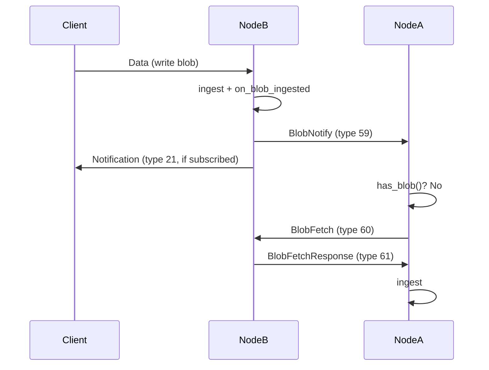

# chromatindb

A decentralized, post-quantum secure database node. Stores cryptographically signed blobs in namespaces, replicates them across peers, and makes data censorship-resistant. Standalone daemon, not a library.

## Architecture

Three-layer system:

- **Node** (`chromatindb`): Standalone C++20 daemon. Stores cryptographically signed blobs in namespaces. Every blob is verified via ML-DSA-87 signature before storage. Encrypted at rest with ChaCha20-Poly1305. Prometheus /metrics endpoint for operational monitoring.
- **Relay**: PQ-authenticated message filter and UDS forwarder. Bridges client connections to the node over Unix domain sockets. Auto-reconnects to node on UDS failure with subscription replay.
- **SDK**: Client libraries for application integration. Python SDK available (`pip install chromatindb`). Supports multi-relay failover and transparent Brotli compression.

### Sync Model

Push-based event-driven sync (no polling timers):

1. Client writes blob to Node B
2. Node B sends BlobNotify to peers whose announced namespaces include the blob's namespace
3. Peer checks local storage; if missing, sends BlobFetch
4. Node B responds with BlobFetchResponse containing the blob
5. Safety-net reconciliation runs every 600s as a correctness backstop
6. Full reconciliation on peer connect catches up missed blobs



### Keepalive

Bidirectional heartbeat -- Ping every 30s to all TCP peers, disconnect after 60s silence. Dead connection detection within one minute.

### Observability

Optional Prometheus-compatible HTTP `/metrics` endpoint. Exposes node health metrics (peer count, blob count, storage bytes, sync stats, uptime) in Prometheus text exposition format.

Enable in config:
```json
{
  "metrics_bind": "127.0.0.1:9090"
}
```

Prometheus scrape configuration:
```yaml
scrape_configs:
  - job_name: 'chromatindb'
    static_configs:
      - targets: ['127.0.0.1:9090']
    scrape_interval: 15s
```

Disabled by default (empty `metrics_bind`). Localhost-only when enabled. SIGHUP-reloadable. See [PROTOCOL.md](db/PROTOCOL.md) for the full metric list.

### Crypto Stack

All cryptographic operations use post-quantum algorithms:

| Algorithm | Purpose | Standard |
|-----------|---------|----------|
| **ML-DSA-87** | Digital signatures | FIPS 204 |
| **ML-KEM-1024** | Key exchange | FIPS 203 |
| **ChaCha20-Poly1305** | Authenticated encryption | RFC 8439 |
| **SHA3-256** | Hashing | FIPS 202 |
| **HKDF-SHA256** | Key derivation | RFC 5869 |

Every blob is signed by its author using ML-DSA-87. Peers establish encrypted channels using ML-KEM-1024 key exchange, then encrypt all traffic with ChaCha20-Poly1305 AEAD. No data travels in plaintext.

## Quick Start

### Prerequisites

- C++20 compiler (GCC 12+ or Clang 15+)
- CMake 3.20+
- Git

### Build

```bash
git clone <repo-url>
cd chromatin-protocol
mkdir build && cd build
cmake ..
cmake --build .
```

All dependencies are fetched automatically via CMake FetchContent.

### Run a Node

```bash
./chromatindb run --config config.json
```

See [db/README.md](db/README.md) for full configuration reference and deployment options.

### Connect with Python SDK

```bash
pip install chromatindb
```

```python
import asyncio
from chromatindb import ChromatinClient, Identity

identity = Identity.generate()

async def main():
    async with ChromatinClient.connect("localhost", 4201, identity) as client:
        result = await client.write_blob(b"Hello, chromatindb!", ttl=3600)
        blob = await client.read_blob(identity.namespace, result.blob_hash)
        print(blob.data)  # b"Hello, chromatindb!"

asyncio.run(main())
```

## Documentation

| Document | Description |
|----------|-------------|
| [Protocol Specification](db/PROTOCOL.md) | Wire protocol, message types, byte formats |
| [Node README](db/README.md) | Build, configuration, testing, deployment |
| [Python SDK](sdk/python/README.md) | API reference, installation |
| [Getting Started Tutorial](sdk/python/docs/getting-started.md) | Step-by-step walkthrough |

## License

MIT
