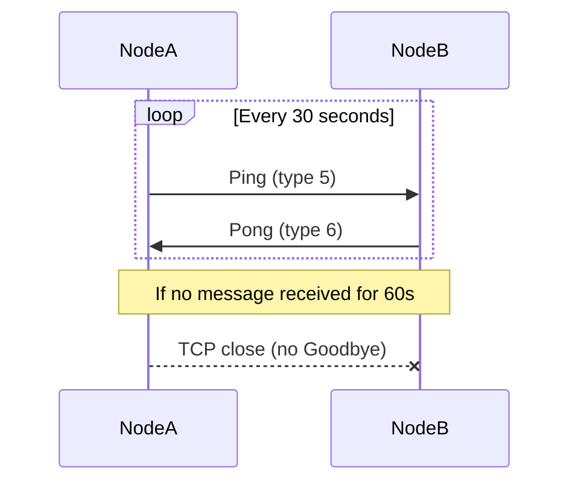
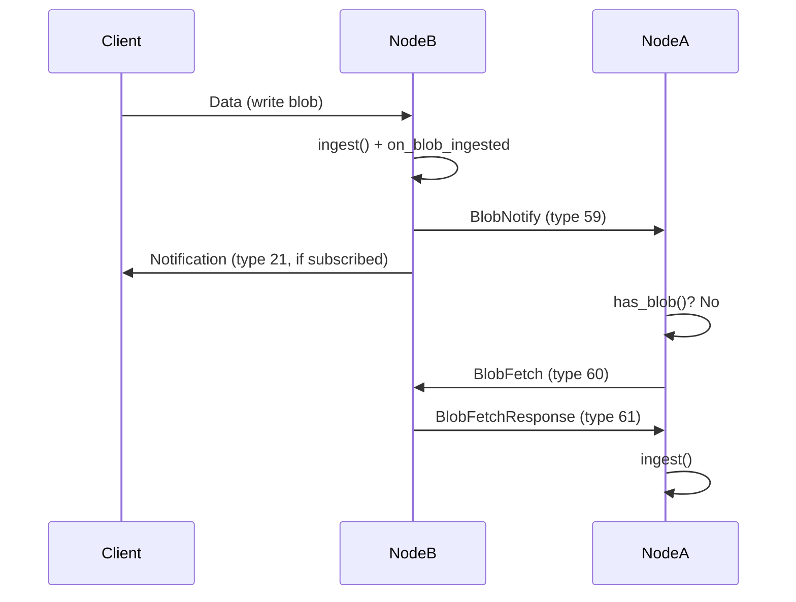

# chromatindb Protocol Walkthrough

This document describes the wire protocol for connecting to and interacting with a chromatindb node. It is written for developers building a compatible client in any language. All values are described at the byte level, independent of any particular serialization library.

## Transport Layer

After the handshake completes, all communication uses AEAD-encrypted frames. Each frame has the following format:

```
[4 bytes: big-endian uint32 ciphertext_length]
[ciphertext_length bytes: AEAD ciphertext]
```

### AEAD Parameters

| Parameter | Value |
|-----------|-------|
| Algorithm | ChaCha20-Poly1305 (IETF, RFC 8439) |
| Key size | 32 bytes (derived from ML-KEM shared secret via HKDF) |
| Nonce size | 12 bytes |
| Nonce format | 4 zero bytes + 8-byte big-endian counter |
| Associated data | Empty (zero-length) |
| Tag size | 16 bytes (appended to ciphertext) |

Each direction (send and receive) maintains its own counter starting at 0. The counter increments by 1 after each frame. The maximum frame size is 110 MiB (115,343,360 bytes).

### Plaintext Format

The plaintext inside each AEAD frame is a FlatBuffers-encoded `TransportMessage`:

```
table TransportMessage {
    type: TransportMsgType;   // 1 byte enum
    payload: [ubyte];         // variable length, type-dependent
    request_id: uint32;       // client-assigned correlation ID
}
```

The `request_id` field enables request pipelining. Clients assign a unique `request_id` to each request and the node echoes it on the corresponding response, allowing clients to send multiple requests without waiting and match responses by `request_id`. Three rules govern its use:

1. **Client-assigned** -- the client sets `request_id` on every request message. Values are arbitrary `uint32`s chosen by the client.
2. **Node-echoed** -- the node copies the `request_id` from the request into the corresponding response (or error signal such as StorageFull or QuotaExceeded).
3. **Per-connection scope** -- `request_id` values are meaningful only within a single connection. Different connections may reuse the same values independently.

Server-initiated messages (Notification, BlobNotify) always carry `request_id = 0`.

The node may process requests concurrently and responses may arrive in a different order than requests were sent. Clients must use `request_id` to correlate responses, not assume ordering.

## Connection Lifecycle

### Step 1: TCP Connect

Connect to the node's `bind_address` (default port 4200) via TCP. No TLS -- the post-quantum handshake provides all transport security.

### Step 2: PQ Handshake

The handshake establishes session keys using ML-KEM-1024 for key exchange and ML-DSA-87 for mutual authentication. It consists of four messages: two raw (unencrypted) KEM messages, then two AEAD-encrypted authentication messages.

```
Initiator                              Responder
    |                                      |
    |--- [raw] KemPubkey ----------------->|  ML-KEM-1024 ephemeral public key (1568 bytes)
    |                                      |  Responder encapsulates: (ciphertext, shared_secret)
    |<-- [raw] KemCiphertext --------------|  ML-KEM-1024 ciphertext (1568 bytes)
    |                                      |  Initiator decapsulates: shared_secret
    |                                      |
    |   Both derive session keys via HKDF-SHA256:
    |     ikm    = shared_secret (ML-KEM output)
    |     salt   = (empty)
    |     info1  = "chromatin-init-to-resp-v1"  -->  initiator-to-responder key (32 bytes)
    |     info2  = "chromatin-resp-to-init-v1"  -->  responder-to-initiator key (32 bytes)
    |     info3  = "chromatin-session-fp-v1"    -->  session fingerprint (32 bytes)
    |                                      |
    |--- [encrypted] AuthSignature ------->|  ML-DSA-87 public key (2592 bytes)
    |                                      |  + ML-DSA-87 signature over session fingerprint
    |<-- [encrypted] AuthSignature --------|  ML-DSA-87 public key (2592 bytes)
    |                                      |  + ML-DSA-87 signature over session fingerprint
    |                                      |
    |   Session established.               |
```

**Message 1 -- KemPubkey (raw, unencrypted):** The initiator generates an ephemeral ML-KEM-1024 keypair and sends the 1568-byte public key as a `TransportMessage` with `type = KemPubkey (1)`. This message is NOT length-prefixed or encrypted -- it is sent as raw FlatBuffer bytes.

**Message 2 -- KemCiphertext (raw, unencrypted):** The responder uses the received public key to encapsulate a shared secret, producing a 1568-byte ciphertext. Sent as `TransportMessage` with `type = KemCiphertext (2)`, also raw.

**Key derivation:** Both sides now hold the same shared secret. They derive three values using HKDF-SHA256:
- **Initiator-to-responder key** (32 bytes) -- the initiator uses this as the send key; the responder uses it as the recv key
- **Responder-to-initiator key** (32 bytes) -- the reverse
- **Session fingerprint** (32 bytes) -- signed by both sides for mutual authentication

The HKDF salt is empty (zero-length). The shared secret from ML-KEM-1024 provides sufficient entropy as the sole IKM input.

**Message 3 -- AuthSignature (encrypted):** The initiator sends its ML-DSA-87 signing public key (2592 bytes) and a signature over the session fingerprint. This is the first AEAD-encrypted frame, using the initiator-to-responder key with nonce counter 0.

**Message 4 -- AuthSignature (encrypted):** The responder sends its ML-DSA-87 signing public key and signature. Encrypted with the responder-to-initiator key, nonce counter 0.

Both sides verify the peer's signature over the session fingerprint. After verification, AEAD nonce counters increment to 1 for both directions.

### Lightweight Handshake (Trusted Peers)

Connections from localhost (127.0.0.1, ::1) or addresses listed in `trusted_peers` use a simplified handshake that skips ML-KEM-1024 key exchange. This reduces connection latency for trusted LAN deployments.

```
Initiator                              Responder
    |                                      |
    |--- [raw] TrustedHello ------------->|  ML-DSA-87 pubkey (2592 bytes) + signature
    |                                      |  Responder checks trust list
    |<-- [raw] TrustedHello --------------|  ML-DSA-87 pubkey (2592 bytes) + signature
    |                                      |
    |   Both derive session keys via HKDF-SHA256:
    |     ikm    = SHA3-256(initiator_pubkey || responder_pubkey)
    |     info1  = "chromatin-init-to-resp-v1"  -->  initiator-to-responder key
    |     info2  = "chromatin-resp-to-init-v1"  -->  responder-to-initiator key
    |                                      |
    |   Session established (AEAD-encrypted from here).
```

If the responder does not recognize the initiator as trusted, it replies with `PQRequired (24)` instead of `TrustedHello`. The initiator then falls back to the full PQ handshake starting from KemPubkey.

### Unix Domain Socket Transport

UDS is an alternative transport for local process communication, enabling applications on the same host to interact with the node without TCP overhead.

**Configuration:** Set `uds_path` in the config JSON to an absolute filesystem path (e.g., `"/run/chromatindb/node.sock"`). Leave empty or omit to disable. Maximum path length is 107 characters (POSIX `sockaddr_un` limit). Changing `uds_path` requires a restart (not SIGHUP-reloadable).

**Wire protocol:** UDS connections use the same length-prefixed AEAD-encrypted frame format as TCP. All message types, payload formats, and protocol phases are identical.

**Handshake:** UDS connections always use the TrustedHello path (local connections are inherently trusted). The full PQ key exchange is skipped. Session keys are derived via HKDF from the exchanged signing public keys, identical to the trusted TCP peer handshake.

**Enforcement:** UDS connections receive the same enforcement as TCP peers:
- ACL gating (allowed_client_keys checked for UDS, allowed_peer_keys for TCP connections after handshake)
- Rate limiting (token bucket per-connection)
- Namespace quotas
- Connection limit (max_peers counts UDS connections)

**Socket permissions:** The socket file is created with mode `0660` (owner and group read/write). Stale socket files from a previous process are automatically unlinked on startup.

**Lifecycle:** The UDS acceptor starts alongside the TCP server during daemon startup and stops during shutdown. The socket file is removed when the acceptor stops.

### Step 3: Encrypted Session

All subsequent messages are AEAD-encrypted `TransportMessage` frames using the established session keys. Nonce counters continue incrementing from where the handshake left off.

If the node has `allowed_peer_keys` configured (for TCP connections) or `allowed_client_keys` (for UDS connections), it checks the peer's signing public key namespace (`SHA3-256(peer_pubkey)`) against the appropriate access control list immediately after the handshake. Unauthorized connections are silently disconnected.

### Keepalive

Both peers MUST send a Ping (type 5, empty payload) every 30 seconds. Any received message -- not just Pong -- resets the peer's silence timer. If no message is received from a peer for 60 seconds (two missed keepalive cycles), the node closes the TCP connection immediately without sending a Goodbye message.

The keepalive mechanism uses `steady_clock` (monotonic) to avoid issues with system clock adjustments. It applies to TCP peers only; UDS connections are excluded from keepalive monitoring.

Pong (type 6, empty payload) is sent in response to Ping. It serves as an explicit liveness acknowledgment, but any application-level traffic (sync, data, PEX) equally satisfies the silence timer.



## Storing a Blob

### Blob Schema

The blob wire format is a FlatBuffers table with six fields:

```
table Blob {
    namespace_id: [ubyte];   // 32 bytes: SHA3-256(author's signing pubkey)
    pubkey: [ubyte];         // 2592 bytes: ML-DSA-87 signing public key
    data: [ubyte];           // variable length: application payload (max 100 MiB)
    ttl: uint32;             // seconds until expiry (writer-controlled, per-blob), 0 = permanent
    timestamp: uint64;       // author's Unix timestamp in seconds
    signature: [ubyte];      // up to 4627 bytes: ML-DSA-87 signature
}
```

### Canonical Signing Input

Blobs are signed over a canonical byte sequence, NOT over the raw FlatBuffer encoding. This makes signature verification independent of serialization format. The signing input is:

```
SHA3-256(namespace_id || data || ttl_le32 || timestamp_le64)
```

Where:
- `namespace_id` -- 32 bytes, the author's namespace
- `data` -- variable length, the blob's application payload
- `ttl_le32` -- 4 bytes, TTL in little-endian uint32
- `timestamp_le64` -- 8 bytes, timestamp in little-endian uint64

The concatenation is hashed with SHA3-256 to produce a 32-byte digest. This digest is then signed with the author's ML-DSA-87 private key.

### Sending a Data Message

To store a blob on a node:

1. Construct the canonical signing input as described above
2. Sign the SHA3-256 digest with the author's ML-DSA-87 private key
3. Build a FlatBuffers `Blob` with all six fields
4. Encode the `Blob` as FlatBuffer bytes
5. Wrap in a `TransportMessage` with `type = Data (8)` and the encoded blob as `payload`
6. Encrypt and send as an AEAD frame

The node validates the signature, checks for duplicates, verifies the namespace matches the public key, and stores the blob. If the node is at capacity, it sends a StorageFull message instead of accepting the blob.

## Sync Protocol

Nodes replicate blobs using a push-then-fetch model. When a blob is ingested, the node immediately pushes a lightweight notification to all connected peers. Peers that do not already have the blob fetch it directly. A periodic full reconciliation runs as a safety net to catch anything missed by the push path.

### Push Notifications

When a blob is ingested -- whether from a client write or from peer sync -- the node sends a BlobNotify (type 59) message to all connected TCP peers. This is the primary replication trigger: peers learn about new blobs within the same event loop tick as ingestion, with no timer delay.

**Source exclusion:** The peer that originated the blob (the connection it arrived on) does NOT receive the BlobNotify. This prevents echo loops in multi-node topologies.

**Sync suppression:** During active reconciliation between two peers (Phase A/B/C in progress), BlobNotify messages for blobs ingested via that sync session are suppressed. This prevents notification storms during bulk catch-up.

**Client notifications:** UDS clients and relay-connected SDK clients do NOT receive BlobNotify. They receive Notification (type 21) if they have active subscriptions for the blob's namespace.

**BlobNotify (type 59) -- 77-byte payload:**

| Field | Offset | Size | Encoding | Description |
|-------|--------|------|----------|-------------|
| namespace_id | 0 | 32 | raw bytes | Blob's namespace |
| blob_hash | 32 | 32 | raw bytes | SHA3-256 of the encoded blob |
| seq_num | 64 | 8 | big-endian uint64 | Sequence number in namespace |
| blob_size | 72 | 4 | big-endian uint32 | Raw data size in bytes |
| is_tombstone | 76 | 1 | uint8 | 0x00 = data, 0x01 = tombstone |

The BlobNotify payload is identical in layout to Notification (type 21). The difference is routing: BlobNotify goes to TCP peers, Notification goes to subscribed clients.



### Targeted Blob Fetch

A peer receiving a BlobNotify checks whether it already has the blob via a local key-only lookup. If the blob is not found locally, and no fetch is already pending for that hash, the peer sends a BlobFetch (type 60) request. The originating node responds with a BlobFetchResponse (type 61) containing either the full blob or a not-found status.

BlobFetch is handled inline in the message loop -- no sync session handshake is required. This makes targeted fetch lightweight compared to full reconciliation.

**Pending fetch dedup:** Only one BlobFetch per blob hash is in-flight at a time per connection. If a second BlobNotify arrives for the same hash while a fetch is pending, the duplicate is silently dropped. Pending fetch entries are cleaned up on disconnect.

**BlobFetch (type 60) -- 64-byte payload:**

| Field | Offset | Size | Encoding | Description |
|-------|--------|------|----------|-------------|
| namespace_id | 0 | 32 | raw bytes | Target namespace |
| blob_hash | 32 | 32 | raw bytes | Hash of the blob to fetch |

**BlobFetchResponse (type 61) -- variable-length payload:**

| Case | Format |
|------|--------|
| Found | `[0x00][flatbuffer_encoded_blob]` |
| Not found | `[0x01]` |

**Note:** The status byte convention for BlobFetchResponse differs from ReadResponse (type 32). ReadResponse uses `0x01` for found and `0x00` for not-found. BlobFetchResponse uses `0x00` for found and `0x01` for not-found.

### Full Reconciliation

Full reconciliation is a three-phase protocol that efficiently transfers blobs between two connected peers. Either side can initiate a sync round.

#### Phase A: Namespace Exchange

```
Initiator                              Responder
    |--- SyncRequest (empty payload) ----->|
    |<-- SyncAccept (empty payload) -------|
    |--- NamespaceList ------------------->|
    |<-- NamespaceList --------------------|
```

The `NamespaceList` payload encodes all namespaces the node has blobs for, along with the latest sequence number per namespace:

```
Wire format: [count: 4 bytes BE uint32]
             [namespace_id: 32 bytes][latest_seq_num: 8 bytes BE uint64]
             [namespace_id: 32 bytes][latest_seq_num: 8 bytes BE uint64]
             ...
```

Each entry is 40 bytes (32-byte namespace ID + 8-byte sequence number). Both sides use the sequence numbers to determine which namespaces need syncing: if the peer has a higher sequence number for a namespace, that namespace has new blobs.

#### Phase B: Set Reconciliation

For each namespace that needs syncing, the initiator drives a multi-round range-based set reconciliation protocol. Both sides sort their blob hashes lexicographically and exchange XOR fingerprints over ranges, recursively splitting mismatched ranges until differences are isolated.

The initiator sends a `ReconcileInit` message to start reconciliation for each namespace:

```
ReconcileInit (type 26):
[version: 1 byte (0x01)]
[namespace_id: 32 bytes]
[count: 4 bytes BE uint32]
[fingerprint: 32 bytes]
```

The `version` byte enables forward-compatible protocol evolution. The `count` and `fingerprint` describe the initiator's full hash set for this namespace (count = number of hashes, fingerprint = XOR of all hashes).

The responder compares its own fingerprint and count against the received values. If they match, the namespace is identical and the responder sends an empty `ReconcileRanges` to signal completion. If they differ, the responder splits the mismatched range and responds with sub-range fingerprints:

```
ReconcileRanges (type 27):
[namespace_id: 32 bytes]
[range_count: 4 bytes BE uint32]
for each range:
    [upper_bound: 32 bytes]
    [mode: 1 byte]  (0=Skip, 1=Fingerprint, 2=ItemList)
    if mode == 1 (Fingerprint):
        [count: 4 bytes BE uint32]
        [fingerprint: 32 bytes]
    if mode == 2 (ItemList):
        [count: 4 bytes BE uint32]
        [hash: 32 bytes] * count
```

Range lower bounds are implicit (the previous range's upper bound, or all-zeros for the first range). Mode values:
- **Skip (0):** Range is identical on both sides; no action needed.
- **Fingerprint (1):** Sub-range fingerprint for further comparison.
- **ItemList (2):** Direct list of hashes in this range (used when item count falls below the split threshold of 16).

The protocol exchanges `ReconcileRanges` back and forth until all ranges are resolved. When one side receives ranges containing only Skip and ItemList modes (no Fingerprint), it performs the final item exchange: it collects the peer's items from the ItemList ranges and sends its own items for those ranges via `ReconcileItems`:

```
ReconcileItems (type 28):
[namespace_id: 32 bytes]
[count: 4 bytes BE uint32]
[hash: 32 bytes] * count
```

After all namespaces are reconciled, the initiator sends `SyncComplete (14)` to signal the end of Phase B. The reconciliation produces a bidirectional diff: both sides now know which hashes they are missing and can request them in Phase C.

#### Phase C: Blob Transfer

The requesting side sends `BlobRequest` messages, each containing up to 64 blob hashes to fetch:

```
BlobRequest wire format: [namespace_id: 32 bytes]
                         [count: 4 bytes BE uint32]
                         [hash: 32 bytes]
                         [hash: 32 bytes]
                         ...
```

The responder replies with `BlobTransfer` messages containing the requested blobs, one blob per transfer:

```
BlobTransfer wire format: [count: 4 bytes BE uint32]
                          [length: 4 bytes BE uint32][FlatBuffer-encoded Blob]
                          ...
```

Each blob is a FlatBuffers-encoded `Blob` (as described in the blob schema above). The receiving side validates each blob (signature, namespace, expiry) before storing it.

Inline peer exchange (PEX) follows immediately after sync completes.

### Reconcile-on-Connect

When a peer connects (or reconnects after downtime), the initiating side triggers a full reconciliation (Phase A/B/C) automatically. This ensures the new peer catches up on all blobs missed during disconnection. Push notifications via BlobNotify begin flowing after the initial sync completes.

### Safety-Net Reconciliation

A full reconciliation runs periodically at a configurable long interval as a correctness backstop. This catches any blobs missed by the push-then-fetch path due to transient errors, message drops, or edge cases in notification suppression.

The interval is controlled by `safety_net_interval_seconds` (default 600 seconds, minimum 3 seconds). The value is reloadable via SIGHUP without restarting the node.

## Additional Interactions

### Blob Deletion

Namespace owners delete blobs by sending a **tombstone** -- a special blob whose data field contains a 4-byte magic prefix followed by the 32-byte hash of the target blob:

```
Tombstone data format: [0xDE 0xAD 0xBE 0xEF][target_blob_hash: 32 bytes]
                       (total: 36 bytes)
```

The tombstone is signed by the namespace owner and sent as a `TransportMessage` with `type = Delete (17)`. The payload is a FlatBuffers-encoded `Blob` where the `data` field contains the tombstone bytes. The `ttl` field is 0 (permanent).

The node responds with `DeleteAck (18)` (empty payload). Tombstones replicate via sync like regular blobs and permanently block future arrival of the deleted blob.

### Namespace Delegation

Namespace owners grant write access to other identities by creating a **delegation blob** -- a blob whose data field contains a 4-byte magic prefix followed by the delegate's ML-DSA-87 public key:

```
Delegation data format: [0xDE 0x1E 0x6A 0x7E][delegate_pubkey: 2592 bytes]
                        (total: 2596 bytes)
```

The delegation blob is signed by the namespace owner and sent as a regular `Data (8)` message. Once stored, the delegate can write blobs to the owner's namespace by signing with their own key. The node verifies that a valid delegation blob exists before accepting the delegate's writes.

Revocation is done by tombstoning the delegation blob.

### Pub/Sub Notifications

Peers subscribe to namespaces to receive real-time notifications when blobs are ingested or deleted.

**Subscribe** (`type = Subscribe (19)`): Payload contains a list of namespace IDs to subscribe to:

```
Subscribe/Unsubscribe wire format: [count: 2 bytes BE uint16]
                                   [namespace_id: 32 bytes]
                                   [namespace_id: 32 bytes]
                                   ...
```

**Unsubscribe** (`type = Unsubscribe (20)`): Same payload format. Removes the listed namespaces from the peer's subscription set.

**Notification** (`type = Notification (21)`): Sent by the node to subscribed peers when a blob is ingested or deleted. Fixed 77-byte payload:

```
Notification wire format: [namespace_id: 32 bytes]
                          [blob_hash: 32 bytes]
                          [seq_num: 8 bytes BE uint64]
                          [blob_size: 4 bytes BE uint32]
                          [is_tombstone: 1 byte (0 or 1)]
```

Subscriptions are connection-scoped and do not persist across reconnections.

### Peer Exchange (PEX)

PEX allows nodes to discover new peers without relying solely on bootstrap nodes. It runs inline after each sync round completes.

**PeerListRequest** (`type = PeerListRequest (15)`): Empty payload. Asks the peer for its known addresses.

**PeerListResponse** (`type = PeerListResponse (16)`): Contains a list of peer addresses:

```
PeerListResponse wire format: [count: 2 bytes BE uint16]
                              [addr_length: 2 bytes BE uint16][address: UTF-8 string]
                              [addr_length: 2 bytes BE uint16][address: UTF-8 string]
                              ...
```

Each address is a `host:port` string. Nodes share up to 8 addresses per response and connect to at most 3 newly discovered peers per PEX round.

### Storage Signaling

**StorageFull** (`type = StorageFull (22)`): Empty payload. Sent by a node when it has reached its configured `max_storage_bytes` limit and cannot accept more blobs. Peers receiving this message suppress sync pushes (blob transfers) to the full node until the next reconnection.

### Quota Signaling

**QuotaExceeded** (`type = QuotaExceeded (25)`): Empty payload. Sent by a node when a blob write would exceed the configured per-namespace byte or count quota. Unlike StorageFull (which signals global capacity), QuotaExceeded indicates that the specific namespace has reached its limit. Other namespaces may still accept writes.

### Sync Rejection

Sync-related operations that cannot proceed are rejected with a `SyncRejected (type 29)` message. The payload is a single byte indicating the rejection reason.

**SyncRejected wire format:**

```
SyncRejected (type 29):
[reason: 1 byte]
```

**Reason codes:**

| Code | Name | Description |
|------|------|-------------|
| 0x01 | Cooldown | Peer initiated sync before the cooldown period elapsed |
| 0x02 | Session limit | Maximum concurrent sync sessions reached |
| 0x03 | Byte rate | Sync traffic exceeded the configured byte rate limit |
| 0x04 | Storage full | Node storage capacity exhausted |
| 0x05 | Quota exceeded | Namespace quota (byte or count limit) exceeded |
| 0x06 | Namespace not found | Requested namespace does not exist on this node |
| 0x07 | Blob too large | Blob data exceeds maximum allowed size |
| 0x08 | Timestamp rejected | Blob timestamp too far in future or past |

After receiving SyncRejected, the initiating peer should wait before retrying. The node's sync cooldown (configurable via `sync_cooldown_seconds`) enforces a minimum interval between sync requests from the same peer. The byte rate limit tracks all sync-related message traffic (reconciliation + blob transfer) per connection.

### Timestamp Validation

Nodes validate blob timestamps before performing any cryptographic verification (Step 0 placement). This prevents nodes from wasting compute on blobs with clearly invalid timestamps.

**Thresholds (hardcoded):**

| Direction | Threshold | Description |
|-----------|-----------|-------------|
| Future | 1 hour (3600 seconds) | Blob timestamp must not be more than 1 hour ahead of the node's system clock |
| Past | 30 days (2,592,000 seconds) | Blob timestamp must not be more than 30 days behind the node's system clock |

The `timestamp` field is a `uint64` Unix epoch value (seconds since 1970-01-01 00:00:00 UTC) from the BlobData structure.

Timestamp validation applies to:
- **Direct writes** (Data messages): Blobs arriving via `Data (8)` or `Delete (17)` are checked before any signature verification.
- **Sync-received blobs**: Blobs arriving during Phase C blob transfer are checked by the engine before ingestion. Blobs that fail timestamp validation are silently skipped (logged at debug level) without aborting the sync session.

Blobs rejected for timestamp validation return `IngestError::timestamp_rejected` with an actionable detail string indicating whether the timestamp was too far in the future or too far in the past.

### Rate Limiting

In addition to sync rejection, per-connection token bucket rate limiting applies to Data (8) and Delete (17) messages. Peers exceeding the configured bytes-per-second throughput (`rate_limit_bytes_per_sec` with `rate_limit_burst` capacity) are disconnected immediately. This rate limiting operates at the message handler level and does not use a rejection message -- the connection is simply closed.

## Client Protocol

Client protocol operations allow authenticated connections to read, list, and query blobs without participating in the sync protocol. These operations are available on all connection types (TCP with PQ handshake, trusted TCP, and UDS).

### WriteAck (type 30)

After a successful `Data (8)` ingest, the node sends a WriteAck back to the connection that submitted the blob. The ack is sent for both new blobs (stored) and duplicates.

**Payload:** 41 bytes

| Field | Offset | Size | Encoding | Description |
|-------|--------|------|----------|-------------|
| blob_hash | 0 | 32 | raw bytes | SHA3-256 of the encoded blob |
| seq_num | 32 | 8 | big-endian uint64 | Sequence number (0 for dedup short-circuit) |
| status | 40 | 1 | uint8 | 0 = stored (new), 1 = duplicate |

### ReadRequest / ReadResponse (types 31-32)

Fetch a specific blob by namespace and content hash.

**ReadRequest payload:** 64 bytes

| Field | Offset | Size | Description |
|-------|--------|------|-------------|
| namespace_id | 0 | 32 | Target namespace |
| blob_hash | 32 | 32 | Content hash of the blob |

**ReadResponse payload:** variable

| Case | Format |
|------|--------|
| Found | `[0x01][flatbuffer_encoded_blob]` |
| Not found | `[0x00]` |

The blob portion uses the same FlatBuffer Blob encoding as Data (8) messages.

### ListRequest / ListResponse (types 33-34)

List blobs in a namespace with cursor-based pagination.

**ListRequest payload:** 44 bytes

| Field | Offset | Size | Encoding | Description |
|-------|--------|------|----------|-------------|
| namespace_id | 0 | 32 | raw bytes | Target namespace |
| since_seq | 32 | 8 | big-endian uint64 | Return blobs with seq > this (0 = from start) |
| limit | 40 | 4 | big-endian uint32 | Max entries (0 or >100 = server default 100) |

**ListResponse payload:** 4 + (count * 40) + 1 bytes

| Field | Offset | Size | Encoding | Description |
|-------|--------|------|----------|-------------|
| count | 0 | 4 | big-endian uint32 | Number of entries |
| entries | 4 | count * 40 | {hash:32, seq_be:8} | Blob hash + sequence number pairs |
| has_more | 4 + count*40 | 1 | uint8 | 1 = more entries available |

To paginate: set `since_seq` to the last `seq_num` in the response. Repeat until `has_more = 0`. Use ReadRequest to fetch full blob data.

### StatsRequest / StatsResponse (types 35-36)

Query namespace usage and quota information.

**StatsRequest payload:** 32 bytes

| Field | Offset | Size | Description |
|-------|--------|------|-------------|
| namespace_id | 0 | 32 | Target namespace |

**StatsResponse payload:** 24 bytes

| Field | Offset | Size | Encoding | Description |
|-------|--------|------|----------|-------------|
| blob_count | 0 | 8 | big-endian uint64 | Number of blobs in namespace |
| total_bytes | 8 | 8 | big-endian uint64 | Total encrypted bytes used |
| quota_bytes | 16 | 8 | big-endian uint64 | Byte quota limit (0 = unlimited) |

Quota remaining = quota_bytes - total_bytes (computed client-side).

### ExistsRequest / ExistsResponse (types 37-38)

Check whether a specific blob exists without transferring its data.

**ExistsRequest payload:** 64 bytes

| Field | Offset | Size | Description |
|-------|--------|------|-------------|
| namespace_id | 0 | 32 | Target namespace |
| blob_hash | 32 | 32 | Content hash of the blob |

**ExistsResponse payload:** 33 bytes

| Field | Offset | Size | Encoding | Description |
|-------|--------|------|----------|-------------|
| exists | 0 | 1 | uint8 | 0x01 = exists, 0x00 = not found |
| blob_hash | 1 | 32 | raw bytes | Echo of the requested blob hash |

Tombstoned blobs return `exists = 0x00`. The echoed `blob_hash` allows clients to correlate responses when pipelining multiple existence checks.

### NodeInfoRequest / NodeInfoResponse (types 39-40)

Query node version, state, and supported message types for SDK capability discovery.

**NodeInfoRequest payload:** empty (0 bytes)

**NodeInfoResponse payload:** variable length

| Field | Offset | Size | Encoding | Description |
|-------|--------|------|----------|-------------|
| version_len | 0 | 1 | uint8 | Length of version string |
| version | 1 | version_len | UTF-8 | Node software version (e.g., "1.1.0") |
| git_hash_len | 1 + version_len | 1 | uint8 | Length of git hash string |
| git_hash | 2 + version_len | git_hash_len | UTF-8 | Build git commit hash |
| uptime | 2 + version_len + git_hash_len | 8 | big-endian uint64 | Node uptime in seconds |
| peer_count | +8 | 4 | big-endian uint32 | Number of connected peers |
| namespace_count | +4 | 4 | big-endian uint32 | Number of namespaces with stored blobs |
| total_blobs | +4 | 8 | big-endian uint64 | Total blob count across all namespaces |
| storage_used | +8 | 8 | big-endian uint64 | Storage bytes used |
| storage_max | +8 | 8 | big-endian uint64 | Configured storage limit (0 = unlimited) |
| types_count | +8 | 1 | uint8 | Number of supported message types |
| supported_types | +1 | types_count | uint8[] | List of supported TransportMsgType values |

The `supported_types` list contains only client-facing message types (types that the relay allows through). Internal protocol types (handshake, sync, PEX) are excluded. Clients use this list for feature detection -- if a type value is present, the node supports that operation.

## Message Type Reference

All message types defined in the `TransportMsgType` enum:

| Value | Name | Description |
|-------|------|-------------|
| 0 | None | Reserved / unset |
| 1 | KemPubkey | ML-KEM-1024 ephemeral public key (handshake step 1) |
| 2 | KemCiphertext | ML-KEM-1024 ciphertext (handshake step 2) |
| 3 | AuthSignature | ML-DSA-87 public key + signature (handshake steps 3-4) |
| 4 | AuthPubkey | Reserved (authentication handled by AuthSignature) |
| 5 | Ping | Keepalive request (empty payload) |
| 6 | Pong | Keepalive response (empty payload) |
| 7 | Goodbye | Graceful disconnect (empty payload) |
| 8 | Data | Blob storage: FlatBuffer-encoded Blob payload |
| 9 | SyncRequest | Sync initiation (empty payload) |
| 10 | SyncAccept | Sync acceptance (empty payload) |
| 11 | NamespaceList | Sync Phase A: namespace IDs with sequence numbers |
| 12 | BlobRequest | Sync Phase C: request blobs by hash (max 64 per message) |
| 13 | BlobTransfer | Sync Phase C: requested blob data |
| 14 | SyncComplete | Sync finished / end of Phase B (empty payload) |
| 15 | PeerListRequest | PEX: request known peer addresses (empty payload) |
| 16 | PeerListResponse | PEX: list of known peer addresses |
| 17 | Delete | Blob deletion: FlatBuffer-encoded tombstone Blob |
| 18 | DeleteAck | Deletion acknowledgment (empty payload) |
| 19 | Subscribe | Pub/sub: subscribe to namespace notifications |
| 20 | Unsubscribe | Pub/sub: unsubscribe from namespace notifications |
| 21 | Notification | Pub/sub: blob ingested/deleted notification (77 bytes) |
| 22 | StorageFull | Capacity signaling: node at storage limit (empty payload) |
| 23 | TrustedHello | Lightweight handshake: trusted peer identity exchange (ML-DSA-87 pubkey + signature, no KEM) |
| 24 | PQRequired | Lightweight handshake rejection: responder requires full PQ handshake (empty payload) |
| 25 | QuotaExceeded | Quota signaling: namespace byte or count limit reached (empty payload) |
| 26 | ReconcileInit | Sync Phase B: start per-namespace reconciliation (version + namespace + count + fingerprint) |
| 27 | ReconcileRanges | Sync Phase B: range fingerprints/items for reconciliation |
| 28 | ReconcileItems | Sync Phase B: final item exchange after ranges resolved |
| 29 | SyncRejected | Sync rate limiting: rejection with 1-byte reason code |
| 30 | WriteAck | Client write acknowledgment: blob_hash + seq_num + status |
| 31 | ReadRequest | Client blob fetch: namespace + hash (64 bytes) |
| 32 | ReadResponse | Client blob fetch response: found flag + optional blob |
| 33 | ListRequest | Client blob listing: namespace + cursor + limit (44 bytes) |
| 34 | ListResponse | Client blob listing response: hash+seq pairs + has_more |
| 35 | StatsRequest | Client namespace stats query: namespace (32 bytes) |
| 36 | StatsResponse | Client namespace stats: count + bytes + quota (24 bytes) |
| 37 | ExistsRequest | Client blob existence check: namespace + hash (64 bytes) |
| 38 | ExistsResponse | Client blob existence result: exists flag + hash (33 bytes) |
| 39 | NodeInfoRequest | Client node info query (empty payload) |
| 40 | NodeInfoResponse | Client node info: version, state, supported types (variable) |
| 41 | NamespaceListRequest | Client namespace enumeration: after_namespace cursor + limit (36 bytes min) |
| 42 | NamespaceListResponse | Client namespace list: namespace entries + has_more flag |
| 43 | StorageStatusRequest | Client storage status query (empty payload) |
| 44 | StorageStatusResponse | Client storage status: disk usage, quota, tombstones (44 bytes) |
| 45 | NamespaceStatsRequest | Client per-namespace stats query: namespace (32 bytes) |
| 46 | NamespaceStatsResponse | Client per-namespace stats: found flag + counters (41 bytes) |
| 47 | MetadataRequest | Client blob metadata query: namespace + hash (64 bytes) |
| 48 | MetadataResponse | Client blob metadata: status + hash + timestamp + ttl + size + seq_num + pubkey (variable) |
| 49 | BatchExistsRequest | Client batch existence check: namespace + count + hashes (36 + N*32 bytes) |
| 50 | BatchExistsResponse | Client batch existence result: per-hash boolean array (N bytes) |
| 51 | DelegationListRequest | Client delegation list: namespace (32 bytes) |
| 52 | DelegationListResponse | Client delegation list: count + pk_hash/blob_hash pairs (4 + N*64 bytes) |
| 53 | BatchReadRequest | Client batch blob fetch: namespace + cap_bytes + count + hashes (40 + N*32 bytes) |
| 54 | BatchReadResponse | Client batch blob data: truncated flag + entries with status/hash/data (variable) |
| 55 | PeerInfoRequest | Client peer info query (empty payload) |
| 56 | PeerInfoResponse | Client peer info: trust-gated response (8 bytes untrusted, variable trusted) |
| 57 | TimeRangeRequest | Client time-range query: namespace + start + end + limit (52 bytes) |
| 58 | TimeRangeResponse | Client time-range result: truncated + entries with hash/seq/timestamp (5 + N*48 bytes) |
| 59 | BlobNotify | Push notification: namespace + hash + seq_num + size + tombstone (77 bytes, peer-internal) |
| 60 | BlobFetch | Targeted blob fetch: namespace + hash (64 bytes, peer-internal) |
| 61 | BlobFetchResponse | Targeted blob fetch response: status + optional blob (peer-internal) |

## Query Extensions

These 10 request/response pairs (types 41-58) use the coroutine-IO dispatch model, echo `request_id`, and are allowed through the relay message filter.

### NamespaceListRequest (Type 41) / NamespaceListResponse (Type 42)

**Direction:** Client -> Node -> Client

**Request payload (minimum 36 bytes):**

| Offset | Size | Field | Description |
|--------|------|-------|-------------|
| 0 | 32 | after_namespace | Cursor: namespaces after this ID (zero = start) |
| 32 | 4 | limit | Max entries to return (big-endian, capped at 1000, default 100) |

**Response payload (variable):**

| Offset | Size | Field | Description |
|--------|------|-------|-------------|
| 0 | 4 | count | Number of entries (big-endian) |
| 4 | 1 | has_more | 0x00 = last page, 0x01 = more namespaces available |
| 5+ | N*40 | entries | Per-entry: [namespace_id:32][blob_count:8 big-endian] |

### StorageStatusRequest (Type 43) / StorageStatusResponse (Type 44)

**Direction:** Client -> Node -> Client

**Request payload:** Empty (0 bytes).

**Response payload (44 bytes):**

| Offset | Size | Field | Description |
|--------|------|-------|-------------|
| 0 | 8 | used_data_bytes | Actual B-tree data occupancy (big-endian) |
| 8 | 8 | max_storage_bytes | Configured storage limit (big-endian) |
| 16 | 8 | tombstone_count | Total tombstones across all namespaces (big-endian) |
| 24 | 4 | namespace_count | Number of namespaces stored (big-endian) |
| 28 | 8 | total_blobs | Total blobs across all namespaces (big-endian) |
| 36 | 8 | mmap_bytes | MDBX mmap file geometry size (big-endian) |

### NamespaceStatsRequest (Type 45) / NamespaceStatsResponse (Type 46)

**Direction:** Client -> Node -> Client

**Request payload (32 bytes):**

| Offset | Size | Field | Description |
|--------|------|-------|-------------|
| 0 | 32 | namespace_id | Namespace to query |

**Response payload (41 bytes):**

| Offset | Size | Field | Description |
|--------|------|-------|-------------|
| 0 | 1 | found | 0x00 = unknown namespace, 0x01 = found |
| 1 | 8 | blob_count | Number of blobs (big-endian, 0 if not found) |
| 9 | 8 | total_bytes | Total bytes stored (big-endian, 0 if not found) |
| 17 | 8 | delegation_count | Active delegations (big-endian, 0 if not found) |
| 25 | 8 | max_bytes | Per-namespace byte quota limit (big-endian) |
| 33 | 8 | max_blobs | Per-namespace blob count limit (big-endian) |

### MetadataRequest (Type 47) / MetadataResponse (Type 48)

**Direction:** Client -> Node -> Client

**Request payload (64 bytes):**

| Offset | Size | Field | Description |
|--------|------|-------|-------------|
| 0 | 32 | namespace_id | Namespace hash |
| 32 | 32 | blob_hash | Content hash of the blob |

**Response payload (variable):**

Not found (1 byte): `[0x00]`

Found:

| Offset | Size | Field | Description |
|--------|------|-------|-------------|
| 0 | 1 | status | 0x01 = found |
| 1 | 32 | blob_hash | Content hash (echo) |
| 33 | 8 | timestamp | Blob timestamp in seconds (big-endian) |
| 41 | 4 | ttl | Time-to-live in seconds (big-endian) |
| 45 | 8 | size | Raw data size in bytes (big-endian) |
| 53 | 8 | seq_num | Sequence number in namespace (big-endian) |
| 61 | 2 | pubkey_len | Signer public key length (big-endian) |
| 63 | N | pubkey | Signer public key bytes |

### BatchExistsRequest (Type 49) / BatchExistsResponse (Type 50)

**Direction:** Client -> Node -> Client

**Request payload (36 + N*32 bytes):**

| Offset | Size | Field | Description |
|--------|------|-------|-------------|
| 0 | 32 | namespace_id | Namespace hash |
| 32 | 4 | count | Number of hashes (big-endian, 1-1024; 0 or >1024 = strike) |
| 36 | N*32 | hashes | Blob hashes to check |

**Response payload (N bytes):**

Per-hash boolean array in request order. `0x01` = exists, `0x00` = not found.

### DelegationListRequest (Type 51) / DelegationListResponse (Type 52)

**Direction:** Client -> Node -> Client

**Request payload (32 bytes):**

| Offset | Size | Field | Description |
|--------|------|-------|-------------|
| 0 | 32 | namespace_id | Namespace to query delegations for |

**Response payload (4 + N*64 bytes):**

| Offset | Size | Field | Description |
|--------|------|-------|-------------|
| 0 | 4 | count | Number of delegation entries (big-endian) |
| 4+ | N*64 | entries | Per-entry: [delegate_pk_hash:32][delegation_blob_hash:32] |

### BatchReadRequest (Type 53) / BatchReadResponse (Type 54)

**Direction:** Client -> Node -> Client

**Request payload (40 + N*32 bytes):**

| Offset | Size | Field | Description |
|--------|------|-------|-------------|
| 0 | 32 | namespace_id | Namespace hash |
| 32 | 4 | cap_bytes | Cumulative response size cap (big-endian, max 4 MiB; 0 = default 4 MiB) |
| 36 | 4 | count | Number of hashes (big-endian, 1-256; 0 or >256 = strike) |
| 40 | N*32 | hashes | Blob hashes to fetch |

**Response payload (variable):**

| Offset | Size | Field | Description |
|--------|------|-------|-------------|
| 0 | 1 | truncated | 0x00 = complete, 0x01 = size cap reached (more blobs requested) |
| 1 | 4 | count | Number of entries in response (big-endian) |
| 5+ | var | entries | Per-entry (see below) |

Per-entry (found): `[0x01][hash:32][size:8 big-endian][data:size bytes]`
Per-entry (not found): `[0x00][hash:32]`

Entries preserve request order. When the cumulative encoded blob size reaches `cap_bytes`, the current blob is included (not truncated mid-blob) and remaining hashes are skipped with `truncated=0x01`.

### PeerInfoRequest (Type 55) / PeerInfoResponse (Type 56)

**Direction:** Client -> Node -> Client

**Request payload:** Empty (0 bytes).

**Response payload (trust-gated):**

**Untrusted clients (8 bytes):**

| Offset | Size | Field | Description |
|--------|------|-------|-------------|
| 0 | 4 | peer_count | Connected peers (big-endian) |
| 4 | 4 | bootstrap_count | Connected bootstrap peers (big-endian) |

**Trusted clients / UDS (variable):**

| Offset | Size | Field | Description |
|--------|------|-------|-------------|
| 0 | 4 | peer_count | Connected peers (big-endian) |
| 4 | 4 | bootstrap_count | Connected bootstrap peers (big-endian) |
| 8+ | var | entries | Per-peer entries (peer_count entries) |

Per-peer entry:

| Offset | Size | Field | Description |
|--------|------|-------|-------------|
| 0 | 2 | addr_len | Address string length (big-endian) |
| 2 | N | address | Peer address string (e.g., "1.2.3.4:9735") |
| 2+N | 1 | is_bootstrap | 0x00 or 0x01 |
| 3+N | 1 | syncing | 0x00 or 0x01 |
| 4+N | 1 | peer_is_full | 0x00 or 0x01 |
| 5+N | 8 | connected_duration_ms | Milliseconds since last message (big-endian) |

Trust detection: UDS connections are always trusted. TCP connections are trusted if the remote IP is loopback (127.0.0.1/::1) or in the node's `trusted_peers` configuration.

### TimeRangeRequest (Type 57) / TimeRangeResponse (Type 58)

**Direction:** Client -> Node -> Client

**Request payload (52 bytes):**

| Offset | Size | Field | Description |
|--------|------|-------|-------------|
| 0 | 32 | namespace_id | Namespace hash |
| 32 | 8 | start_timestamp | Range start in seconds (big-endian, inclusive) |
| 40 | 8 | end_timestamp | Range end in seconds (big-endian, inclusive) |
| 48 | 4 | limit | Max results (big-endian, capped at 100; 0 = default 100) |

Validation: `start_timestamp > end_timestamp` triggers a strike.

**Response payload (5 + N*48 bytes):**

| Offset | Size | Field | Description |
|--------|------|-------|-------------|
| 0 | 1 | truncated | 0x00 = complete, 0x01 = scan limit or result limit reached |
| 1 | 4 | count | Number of result entries (big-endian) |
| 5+ | N*48 | entries | Per-entry: [blob_hash:32][seq_num:8 big-endian][timestamp:8 big-endian] |

Implementation scans the namespace's sequence map (up to 10,000 entries) and filters by timestamp range. Returns blob references only (not full blob data). Clients use ReadRequest or BatchReadRequest to fetch the actual blob data.

## SDK Client Notes

Implementation details for SDK developers connecting to chromatindb via relay.

### AEAD Nonce Counters

Post-handshake AEAD nonce counters start at 1 in both directions, not 0. Nonce 0 is consumed by the AuthSignature messages (Message 3 and Message 4) during the PQ handshake. Each direction maintains an independent counter.

### Ping/Pong Behavior

The C++ relay sends Pong responses with `request_id = 0`, regardless of the request_id sent in the Ping. SDK implementations should use a dedicated send path for Ping that does not rely on request_id correlation. A FIFO pending queue for Pong responses works well.

### Wire Format Endianness

The protocol uses mixed endianness:
- **Big-endian:** Frame length prefix (4 bytes), most wire format fields
- **Little-endian:** Auth payload `pubkey_size` field (4 bytes), canonical signing input fields `ttl` (4 bytes) and `timestamp` (8 bytes)

SDK implementations must encode/decode each field with the correct byte order.

### Exception Hierarchy

The Python SDK defines `chromatindb.exceptions.ConnectionError` which inherits from `ProtocolError`, not from Python's builtin `ConnectionError`. This is intentional -- SDK connection errors are protocol-level events, not OS-level socket errors. Code that catches `builtins.ConnectionError` will not catch SDK connection timeouts.

### FlatBuffers Determinism

FlatBuffers serialization is not deterministic across languages. The same logical message may produce different bytes in Python vs C++. Always use the server-returned `blob_hash` (from WriteAck) rather than computing it client-side from the serialized FlatBuffer.

### ML-DSA-87 Signature Non-determinism

ML-DSA-87 signatures are non-deterministic -- signing the same data twice produces different signatures. Since the FlatBuffer blob includes the signature, this means writing identical data produces a different `blob_hash` each time. SDK tests should verify individual fields (data, ttl, timestamp) rather than comparing serialized bytes.

## Client-Side Envelope Encryption

Multi-recipient envelope encryption for zero-knowledge storage. The node never sees plaintext -- all encryption and decryption happens in the SDK.

### Overview

Envelope encryption uses the KEM-then-Wrap pattern:

1. A random 32-byte Data Encryption Key (DEK) encrypts the plaintext once with ChaCha20-Poly1305
2. For each recipient: ML-KEM-1024 encapsulation produces a shared secret, HKDF-SHA256 derives a Key Encryption Key (KEK) using the info label `chromatindb-envelope-kek-v1` and empty salt, and the KEK wraps the DEK via ChaCha20-Poly1305 with a zero nonce
3. The sender is always auto-included as a recipient (cannot lock yourself out)
4. Recipient stanzas are sorted by `pk_hash` (SHA3-256 of KEM public key) for O(log N) binary search during decryption

Content-addressed deduplication breaks on encrypted data because identical plaintext produces different ciphertext (random DEK, random nonce). This is expected and correct -- it is a fundamental property of randomized encryption.

### Envelope Binary Format

An envelope is a self-contained binary blob stored as the data payload of a standard chromatindb blob. The format is:

```
[magic:4][version:1][suite:1][recipient_count:2 BE][data_nonce:12][N x stanza:1648][ciphertext+tag]
```

**Fixed header (20 bytes):**

| Offset | Size | Field | Encoding | Description |
|--------|------|-------|----------|-------------|
| 0 | 4 | magic | `CENV` (0x43454E56) | Envelope format identifier |
| 4 | 1 | version | uint8 | Format version (0x01) |
| 5 | 1 | suite | uint8 | Cipher suite (0x01 = ML-KEM-1024 + ChaCha20-Poly1305) |
| 6 | 2 | recipient_count | big-endian uint16 | Number of recipient stanzas (1-256) |
| 8 | 12 | data_nonce | raw bytes | Random nonce for data AEAD encryption |

**Per-recipient stanza (1648 bytes each, sorted by pk_hash):**

| Offset | Size | Field | Description |
|--------|------|-------|-------------|
| 0 | 32 | kem_pk_hash | SHA3-256 of recipient's ML-KEM-1024 public key |
| 32 | 1568 | kem_ciphertext | ML-KEM-1024 encapsulation ciphertext |
| 1600 | 48 | wrapped_dek | AEAD-encrypted DEK (32-byte key + 16-byte Poly1305 tag) |

**Data payload (variable):**

| Offset | Size | Field | Description |
|--------|------|-------|-------------|
| 20 + N*1648 | variable | ciphertext | ChaCha20-Poly1305 encrypted data + 16-byte tag |

Total envelope size: `20 + (N * 1648) + len(plaintext) + 16` bytes

Per-recipient overhead: 1648 bytes (32 hash + 1568 KEM ciphertext + 48 wrapped DEK)

### AEAD Parameters

#### Data Encryption

| Parameter | Value |
|-----------|-------|
| Algorithm | ChaCha20-Poly1305 (IETF, RFC 8439) |
| Key | Random 32-byte DEK (`secrets.token_bytes(32)`) |
| Nonce | Random 12 bytes (`secrets.token_bytes(12)`) -- NOT counter-based |
| Associated data | Full envelope header: fixed header (20 bytes) + all recipient stanzas (N * 1648 bytes) |
| Tag | 16 bytes (appended to ciphertext) |

The data nonce is random, in contrast to transport AEAD nonces which use a counter (4 zero bytes + 8-byte big-endian counter). Random nonces are correct here because each envelope uses a fresh random DEK -- the same key is never used twice.

#### DEK Wrapping

| Parameter | Value |
|-----------|-------|
| Algorithm | ChaCha20-Poly1305 (IETF, RFC 8439) |
| Key | 32-byte KEK derived via HKDF-SHA256 from ML-KEM shared secret |
| Nonce | 12 zero bytes (0x000000000000000000000000) |
| Associated data | Partial header (fixed 20 bytes) + all pk_hash (32 bytes each) + all kem_ciphertext (1568 bytes each) accumulated so far |
| Output | 48 bytes (32-byte DEK + 16-byte Poly1305 tag) |

Zero nonce is safe because the HKDF-derived KEK is unique per KEM encapsulation -- the ML-KEM shared secret is different for every recipient in every envelope, so the key is never reused.

The KEK is derived as: `HKDF-SHA256(ikm=shared_secret, salt=empty, info="chromatindb-envelope-kek-v1")` producing 32 bytes.

### HKDF Label Registry

All HKDF-SHA256 domain separation labels used in the chromatindb protocol:

| Label | Purpose | Salt | IKM | Output | Source |
|-------|---------|------|-----|--------|--------|
| `chromatin-init-to-resp-v1` | Transport send key (initiator) / recv key (responder) | empty | ML-KEM shared secret | 32 bytes | Handshake (Step 2) |
| `chromatin-resp-to-init-v1` | Transport recv key (initiator) / send key (responder) | empty | ML-KEM shared secret | 32 bytes | Handshake (Step 2) |
| `chromatindb-dare-v1` | Data-at-rest encryption key (node-level) | empty | Node master key | 32 bytes | Node storage |
| `chromatindb-envelope-kek-v1` | Envelope KEK for DEK wrapping (per-recipient) | empty | ML-KEM shared secret (per encapsulation) | 32 bytes | Envelope encryption |

The session fingerprint shown in the handshake diagram (`chromatin-session-fp-v1`) is NOT an HKDF derivation. Both C++ and Python compute it as `SHA3-256(shared_secret + init_pk + resp_pk)`.

### Decryption

To decrypt an envelope:

1. Parse fixed header: validate magic `CENV` (0x43454E56), version 0x01, suite 0x01
2. Compute `SHA3-256(own_kem_public_key)` to get own pk_hash
3. Binary search the sorted stanzas for a matching pk_hash
4. If not found, reject with NotARecipientError
5. Decapsulate `kem_ciphertext` with own KEM secret key to recover the shared secret
6. Derive KEK: `HKDF-SHA256(ikm=shared_secret, salt=empty, info="chromatindb-envelope-kek-v1")` producing 32 bytes
7. Decrypt `wrapped_dek` with KEK and zero nonce to recover the 32-byte DEK
8. Decrypt data ciphertext with DEK and `data_nonce` from header, using the full header (fixed header + all recipient stanzas) as associated data
