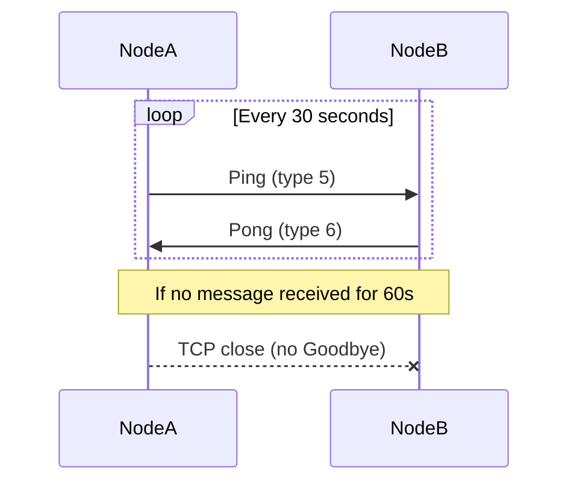
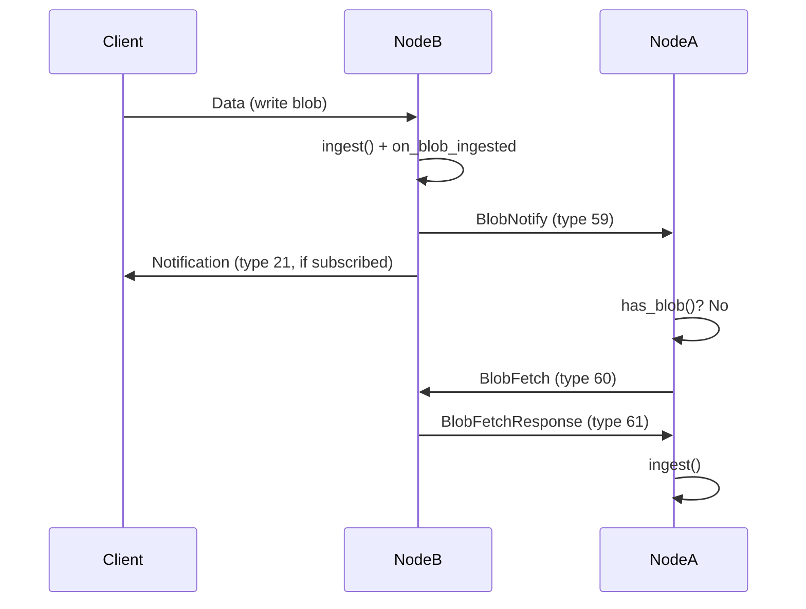

# chromatindb Protocol Walkthrough

This document describes the wire protocol for connecting to and interacting with a chromatindb node. It is written for developers building a compatible client in any language. All values are described at the byte level, independent of any particular serialization library.

## Transport Layer

After the handshake completes, all communication uses AEAD-encrypted frames. Each frame has the following format:

```
[4 bytes: big-endian uint32 ciphertext_length]
[ciphertext_length bytes: AEAD ciphertext]
```

### AEAD Parameters

| Parameter | Value |
|-----------|-------|
| Algorithm | ChaCha20-Poly1305 (IETF, RFC 8439) |
| Key size | 32 bytes (derived from ML-KEM shared secret via HKDF) |
| Nonce size | 12 bytes |
| Nonce format | 4 zero bytes + 8-byte big-endian counter |
| Associated data | Empty (zero-length) |
| Tag size | 16 bytes (appended to ciphertext) |

Each direction (send and receive) maintains its own counter starting at 0. The counter increments by 1 after each frame. The maximum frame size is 110 MiB (115,343,360 bytes).

### Plaintext Format

The plaintext inside each AEAD frame is a FlatBuffers-encoded `TransportMessage`:

```
table TransportMessage {
    type: TransportMsgType;   // 1 byte enum
    payload: [ubyte];         // variable length, type-dependent
    request_id: uint32;       // client-assigned correlation ID
}
```

The `request_id` field enables request pipelining. Clients assign a unique `request_id` to each request and the node echoes it on the corresponding response, allowing clients to send multiple requests without waiting and match responses by `request_id`. Three rules govern its use:

1. **Client-assigned** -- the client sets `request_id` on every request message. Values are arbitrary `uint32`s chosen by the client.
2. **Node-echoed** -- the node copies the `request_id` from the request into the corresponding response (or error signal such as StorageFull or QuotaExceeded).
3. **Per-connection scope** -- `request_id` values are meaningful only within a single connection. Different connections may reuse the same values independently.

Server-initiated messages (Notification, BlobNotify) always carry `request_id = 0`.

The node may process requests concurrently and responses may arrive in a different order than requests were sent. Clients must use `request_id` to correlate responses, not assume ordering.

### Chunked Transport Framing

Payloads >= 1 MiB (the streaming threshold) use chunked sub-frame encoding instead of a single TransportMessage. This allows large blobs (up to 500 MiB) to be sent without allocating the full payload as a single AEAD frame.

A chunked sequence consists of three parts:

**1. Header sub-frame** (14+ bytes, first byte is `0x01`):

```
[0x01: flags byte (CHUNKED_BEGIN)]
[type: 1 byte (TransportMsgType)]
[request_id: 4 bytes big-endian uint32]
[total_payload_size: 8 bytes big-endian uint64]
[extra_metadata: 0+ bytes (optional, e.g. status byte for ReadResponse)]
```

**2. Data sub-frames** (1 MiB each, last may be smaller):

Each data sub-frame contains raw payload bytes (no TransportMessage wrapper). Sub-frames are sent sequentially until the entire payload is transmitted.

**3. Zero-length sentinel**:

An empty frame (0 bytes of plaintext) signals the end of the chunked sequence.

Each sub-frame (header, data chunks, and sentinel) is independently AEAD-encrypted with the connection's shared nonce counter. Each sub-frame consumes exactly one nonce. The receiver detects chunked mode by checking if the first byte of a decrypted frame is `0x01` -- FlatBuffer messages never start with this byte.

Payloads below the streaming threshold continue to use the standard single-frame TransportMessage encoding.

The sender must ensure the entire chunked sequence is sent atomically -- no other messages may be interleaved between the header and the sentinel on the same connection.

## Connection Lifecycle

### Step 1: TCP Connect

Connect to the node's `bind_address` (default port 4200) via TCP. No TLS -- the post-quantum handshake provides all transport security.

### Step 2: PQ Handshake

The handshake establishes session keys using ML-KEM-1024 for key exchange and ML-DSA-87 for mutual authentication. It consists of four messages: two raw (unencrypted) KEM messages, then two AEAD-encrypted authentication messages.

```
Initiator                              Responder
    |                                      |
    |--- [raw] KemPubkey ----------------->|  ML-KEM-1024 ephemeral public key (1568 bytes)
    |                                      |  Responder encapsulates: (ciphertext, shared_secret)
    |<-- [raw] KemCiphertext --------------|  ML-KEM-1024 ciphertext (1568 bytes)
    |                                      |  Initiator decapsulates: shared_secret
    |                                      |
    |   Both derive session keys via HKDF-SHA256:
    |     ikm    = shared_secret (ML-KEM output)
    |     salt   = (empty)
    |     info1  = "chromatin-init-to-resp-v1"  -->  initiator-to-responder key (32 bytes)
    |     info2  = "chromatin-resp-to-init-v1"  -->  responder-to-initiator key (32 bytes)
    |
    |   Session fingerprint (NOT HKDF -- direct hash):
    |     SHA3-256(shared_secret || initiator_pubkey || responder_pubkey)  -->  32 bytes
    |                                      |
    |--- [encrypted] AuthSignature ------->|  role (1 byte) + ML-DSA-87 pubkey (2592)
    |                                      |  + ML-DSA-87 signature over session fingerprint
    |<-- [encrypted] AuthSignature --------|  role (1 byte) + ML-DSA-87 pubkey (2592)
    |                                      |  + ML-DSA-87 signature over session fingerprint
    |                                      |
    |   Session established.               |
```

**Message 1 -- KemPubkey (raw, unencrypted):** The initiator generates an ephemeral ML-KEM-1024 keypair and sends the 1568-byte public key as a `TransportMessage` with `type = KemPubkey (1)`. This message is NOT length-prefixed or encrypted -- it is sent as raw FlatBuffer bytes.

**Message 2 -- KemCiphertext (raw, unencrypted):** The responder uses the received public key to encapsulate a shared secret, producing a 1568-byte ciphertext. Sent as `TransportMessage` with `type = KemCiphertext (2)`, also raw.

**Key derivation:** Both sides now hold the same shared secret. They derive three values using HKDF-SHA256:
- **Initiator-to-responder key** (32 bytes) -- the initiator uses this as the send key; the responder uses it as the recv key
- **Responder-to-initiator key** (32 bytes) -- the reverse
- **Session fingerprint** (32 bytes) -- signed by both sides for mutual authentication

The HKDF salt is empty (zero-length). The shared secret from ML-KEM-1024 provides sufficient entropy as the sole IKM input.

**Message 3 -- AuthSignature (encrypted):** The initiator sends its declared connection role (1 byte), its ML-DSA-87 signing public key (2592 bytes), and a signature over the session fingerprint. This is the first AEAD-encrypted frame, using the initiator-to-responder key with nonce counter 0.

**Message 4 -- AuthSignature (encrypted):** The responder sends its own role, ML-DSA-87 signing public key, and signature. Encrypted with the responder-to-initiator key, nonce counter 0.

Both sides verify the peer's signature over the session fingerprint. The receiver also consults the role byte to route the connection through the correct ACL allow-list (see "Role Signalling" below). Unknown role values MUST be rejected fail-closed so future role definitions are never misinterpreted by old binaries. After verification, AEAD nonce counters increment to 1 for both directions.

### Lightweight Handshake (Trusted Peers)

Connections from localhost (127.0.0.1, ::1) or addresses listed in `trusted_peers` use a simplified handshake that skips ML-KEM-1024 key exchange. This reduces connection latency for trusted LAN deployments.

```
Initiator                              Responder
    |                                      |
    |--- [raw] TrustedHello ------------->|  nonce (32 bytes) + ML-DSA-87 pubkey (2592 bytes)
    |                                      |  Responder checks trust list
    |<-- [raw] TrustedHello --------------|  nonce (32 bytes) + ML-DSA-87 pubkey (2592 bytes)
    |                                      |
    |   Both derive session keys via HKDF-SHA256:
    |     ikm    = initiator_nonce || responder_nonce  (64 bytes)
    |     salt   = initiator_signing_pk || responder_signing_pk  (5184 bytes)
    |     info1  = "chromatin-init-to-resp-v1"  -->  initiator-to-responder key
    |     info2  = "chromatin-resp-to-init-v1"  -->  responder-to-initiator key
    |     fingerprint = SHA3-256(ikm || salt)
    |                                      |
    |   AEAD-encrypted from here:
    |                                      |
    |--- [enc] AuthSignature ------------>|  role + ML-DSA-87 pubkey + signature(fingerprint)
    |<-- [enc] AuthSignature -------------|  role + ML-DSA-87 pubkey + signature(fingerprint)
    |                                      |
    |   Both verify: AuthSignature pubkey matches TrustedHello pubkey.
    |   Receiver uses role byte to pick the ACL allow-list.
    |   Session established.
```

If the responder does not recognize the initiator as trusted, it replies with `PQRequired (24)` instead of `TrustedHello`. The initiator then falls back to the full PQ handshake starting from KemPubkey.

### Unix Domain Socket Transport

UDS is an alternative transport for local process communication, enabling applications on the same host to interact with the node without TCP overhead.

**Configuration:** Set `uds_path` in the config JSON to an absolute filesystem path (e.g., `"/run/chromatindb/node.sock"`). Leave empty or omit to disable. Maximum path length is 107 characters (POSIX `sockaddr_un` limit). Changing `uds_path` requires a restart (not SIGHUP-reloadable).

**Wire protocol:** UDS connections use the same length-prefixed AEAD-encrypted frame format as TCP. All message types, payload formats, and protocol phases are identical.

**Handshake:** UDS connections always use the TrustedHello path (local connections are inherently trusted). The full PQ key exchange is skipped. Session keys are derived via HKDF from exchanged nonces and signing public keys, identical to the trusted TCP peer handshake.

**Enforcement:** UDS connections receive the same enforcement as TCP peers:
- ACL gating (allowed_client_keys checked for UDS, allowed_peer_keys for TCP connections after handshake)
- Rate limiting (token bucket per-connection)
- Namespace quotas
- Connection limit (max_peers counts UDS connections)

**Socket permissions:** The socket file is created with mode `0660` (owner and group read/write). Stale socket files from a previous process are automatically unlinked on startup.

**Lifecycle:** The UDS acceptor starts alongside the TCP server during daemon startup and stops during shutdown. The socket file is removed when the acceptor stops.

### Role Signalling

Every `AuthSignature` payload starts with a 1-byte role field that declares the purpose of the connection. The receiver uses this role -- not ACL allow-list membership -- to decide whether the connection participates in peer-to-peer replication, client API access, or (when implemented) observer / admin / relay flows.

**AuthSignature payload format:**

```
[role:1][pubkey_size:4 BE][pubkey:2592][signature:variable]
```

The role byte is carried inside the AEAD-encrypted AuthSignature frame, so its integrity is protected by the session keys -- an on-path attacker cannot flip the role without breaking the AEAD tag.

**Role values:**

| Value | Name | Purpose |
|-------|------|---------|
| 0x00 | PEER | Full node-to-node replication (sync, PEX, dedup, BlobNotify) |
| 0x01 | CLIENT | Read/write API access (blobs, queries, subscriptions) |
| 0x02 | OBSERVER | (reserved) Read-only -- metrics, backup dumpers, auditors |
| 0x03 | ADMIN | (reserved) Privileged CLI -- config reload, revoke |
| 0x04 | RELAY | (reserved) Bridge/relay node |
| 0x05..0xFE | -- | Reserved for future roles |
| 0xFF | -- | Reserved (sentinel / error) |

**Rules:**

- Initiators MUST declare their intended role. The `chromatindb` node sends `PEER` when dialing another node. The `cdb` CLI sends `CLIENT`.
- Responders MUST fail-closed on unknown role values -- decoding returns a protocol error if the role byte is not in the currently-implemented set. This guarantees future role additions cannot be silently accepted by older binaries.
- UDS connections are forced to `CLIENT` role on the receiver side regardless of what the initiator declared. The UDS socket is filesystem-permission-gated and is never used for node-to-node peering.
- Reserved values (OBSERVER, ADMIN, RELAY, 0x05..0xFE, 0xFF) MUST be rejected until the implementing version ships the corresponding receiver-side logic.

**ACL routing:** After the handshake completes, the receiver consults the appropriate allow-list based on the declared role -- `allowed_client_keys` for `CLIENT`, `allowed_peer_keys` for `PEER`, and so on. Open-mode allow-lists (empty) allow any identity for that role.

### Step 3: Encrypted Session

All subsequent messages are AEAD-encrypted `TransportMessage` frames using the established session keys. Nonce counters continue incrementing from where the handshake left off.

If the node has `allowed_peer_keys` configured (for TCP peer-role connections) or `allowed_client_keys` (for client-role connections -- TCP or UDS), it checks the peer's signing public key namespace (`SHA3-256(peer_pubkey)`) against the appropriate access control list immediately after the handshake. The list to check is determined by the role the remote declared in its AuthSignature payload. Unauthorized connections are silently disconnected.

### Keepalive

Both peers MUST send a Ping (type 5, empty payload) every 30 seconds. Any received message -- not just Pong -- resets the peer's silence timer. If no message is received from a peer for 60 seconds (two missed keepalive cycles), the node closes the TCP connection immediately without sending a Goodbye message.

The keepalive mechanism uses `steady_clock` (monotonic) to avoid issues with system clock adjustments. It applies to TCP peers only; UDS connections are excluded from keepalive monitoring.

Pong (type 6, empty payload) is sent in response to Ping. It serves as an explicit liveness acknowledgment, but any application-level traffic (sync, data, PEX) equally satisfies the silence timer.



## Storing a Blob

### Blob Schema

The blob wire format is a FlatBuffers table with **five** fields (post-v4.1.0 / Phase 122):

```
table Blob {
    signer_hint: [ubyte];   // 32 bytes: SHA3-256(author's ML-DSA-87 signing pubkey)
    data:        [ubyte];   // variable length: application payload (max 500 MiB)
    ttl:         uint32;    // seconds until expiry (writer-controlled, per-blob), 0 = permanent
    timestamp:   uint64;    // author's Unix timestamp in seconds
    signature:   [ubyte];   // up to 4627 bytes: ML-DSA-87 signature
}
```

The `signer_hint` field is the 32-byte SHA3-256 of the author's ML-DSA-87 signing public key. The node resolves `signer_hint → signing_pk` via its `owner_pubkeys` DBI (see [§owner_pubkeys DBI](#owner_pubkeys-dbi)) when verifying the signature, so the 2592-byte signing pubkey never travels inside a `Blob`. This saves ~2.5 KiB per blob versus the pre-v4.1.0 6-field shape.

The 32-byte namespace identifier is NOT present inside a `Blob`. Routing is carried at the transport layer by `BlobWriteBody.target_namespace` (see [§Sending a Blob](#sending-a-blob-blobwrite--64)) and at sync time by a per-blob `target_namespace` prefix in `BlobTransfer` (see [§Phase C: Blob Transfer](#phase-c-blob-transfer)).

### Canonical Signing Input

Blobs are signed over a canonical byte sequence, NOT over the raw FlatBuffer encoding. This makes signature verification independent of serialization format. The signing input is:

```
SHA3-256(target_namespace || data || ttl_be32 || timestamp_be64)
```

Where:
- `target_namespace` -- 32 bytes, the namespace the blob is being written INTO. For owner writes this equals `SHA3-256(signing_pk)` (i.e. the owner's own namespace). For delegate writes it equals the target owner's namespace, NOT the delegate's.
- `data` -- variable length, the blob's application payload
- `ttl_be32` -- 4 bytes, TTL in big-endian uint32
- `timestamp_be64` -- 8 bytes, timestamp in big-endian uint64

The concatenation is hashed with SHA3-256 to produce a 32-byte digest. This digest is then signed with the author's ML-DSA-87 private key.

The `target_namespace` parameter name is a rename from the pre-v4.1.0 `namespace_id`. The byte output is unchanged (SHA3-256 sees identical bytes), so signatures produced before the rename remain valid after.

### Sending a Blob (BlobWrite = 64)

To store a blob on a node:

1. Construct the canonical signing input: `SHA3-256(target_namespace || data || ttl_be32 || timestamp_be64)`.
2. Sign the 32-byte digest with the author's ML-DSA-87 private key. The signature is non-deterministic (see [§ML-DSA-87 Signature Non-determinism](#ml-dsa-87-signature-non-determinism)).
3. Build a FlatBuffers `Blob` with the 5 post-v4.1.0 fields: `signer_hint` = SHA3-256(signing_pk), `data`, `ttl`, `timestamp`, `signature`.
4. Wrap the `Blob` in a `BlobWriteBody` envelope:
   ```
   table BlobWriteBody {
       target_namespace: [ubyte];  // 32 bytes
       blob: Blob;
   }
   ```
5. Encode the `BlobWriteBody` as FlatBuffer bytes.
6. Wrap in a `TransportMessage` with `type = BlobWrite (64)` and the encoded `BlobWriteBody` as `payload`.
7. Encrypt and send as an AEAD frame. The node replies with `WriteAck (30)`.

The node validates the blob in order: timestamp window → PUBK-first gate (see [§PUBK-First Invariant](#pubk-first-invariant)) → signer_hint resolution through `owner_pubkeys` / `delegation` DBIs → ML-DSA-87 signature verification → dedup → quota / capacity. If the node is at capacity it sends `StorageFull (22)`; if the namespace quota is exhausted it sends `QuotaExceeded (25)`.

**Write-path envelope ownership:**

| Envelope | TransportMsgType | Typical payload shapes |
|----------|------------------|------------------------|
| `BlobWrite` | `64` | Owner writes, delegate writes, PUBK publish, BOMB batched tombstones, NAME pointers, CDAT chunks, CPAR manifests, CENV envelopes — anything that is a signed `Blob` with a 4-byte magic prefix in `data` (or raw application data). |
| `Delete` | `17` | Single-target tombstones. Retained post-v4.1.0 for backwards-compatible `DeleteAck (18)` handling. Payload is a `BlobWriteBody` whose `blob.data` is `[0xDEADBEEF][target_hash:32]` (see [§Blob Deletion](#blob-deletion)). |

Both envelopes carry the same `BlobWriteBody { target_namespace, blob }` payload shape. The node's dispatchers differ only in ACK type (`WriteAck` vs `DeleteAck`) and in the structural precondition that `Delete` must carry a tombstone-shaped `data`.

The pre-v4.1.0 `TransportMsgType_Data = 8` enum position is DELETED; no live write path uses it. External client implementers MUST NOT send `type = 8` — the dispatcher returns `ErrorResponse` with `unknown_type (0x02)`. See the [§Message Type Reference](#message-type-reference) table for the canonical enum.

### Namespace Derivation

A namespace is 32 bytes, derived once per identity as:

```
namespace = SHA3-256(signing_pubkey)
```

Where `signing_pubkey` is the 2592-byte ML-DSA-87 public key of the identity that owns the namespace. The derivation is performed ONCE per identity — never per blob. Clients compute their own namespace at keygen time; other parties compute a peer's namespace by fetching the peer's PUBK blob (see [§PUBK Blob Format](#pubk-blob-format)) and hashing the `signing_pk` portion.

Consequences:

- A `Blob` does NOT carry its namespace — the 32-byte identifier is never inside the FlatBuffer. See [§Blob Schema](#blob-schema).
- On the wire, the namespace is supplied alongside the blob by the envelope: `BlobWriteBody.target_namespace` (client writes) or the per-blob 32-byte prefix in `BlobTransfer` payloads (sync Phase C, see [§Phase C: Blob Transfer](#phase-c-blob-transfer)).
- The node verifies a blob's membership in a namespace by resolving `signer_hint → signing_pk` via [§owner_pubkeys DBI](#owner_pubkeys-dbi) and checking `SHA3-256(signing_pk) == target_namespace` (owner write) OR that a valid delegation blob authorizes the signer for that `target_namespace` (delegate write).

### signer_hint Semantics

The `signer_hint` field inside every `Blob` is 32 bytes, equal to `SHA3-256(signer's ML-DSA-87 signing_pk)`. It is a stable, collision-resistant handle for the identity that produced the signature — never the raw 2592-byte pubkey.

- **Owner writes:** `signer_hint` equals the `target_namespace` (both are `SHA3-256(signing_pk)` of the same identity). The node can verify by looking up `signer_hint` in [§owner_pubkeys DBI](#owner_pubkeys-dbi) and confirming `SHA3-256(resolved_pk) == target_namespace`.
- **Delegate writes:** `signer_hint` equals the delegate's own namespace — NOT the `target_namespace`. The node looks up `(target_namespace, signer_hint)` in the `delegation` DBI (`[namespace:32][delegate_pk_hash:32] → delegation_blob_hash:32`) to confirm the owner has authorized this signer, then resolves `signer_hint → signing_pk` via `owner_pubkeys` to verify the signature. Delegates cannot impersonate the owner because the `signer_hint` is structurally bound to the delegate's own pubkey at blob-build time.
- **Server-side resolution:** the `owner_pubkeys` DBI is keyed BY `signer_hint` (not by namespace). A single row per registered identity suffices for both "write into own namespace" (owner) and "write into someone else's namespace" (delegate) — in both cases the signer's own `signer_hint` is the key.

Rationale: replaces the 2592-byte embedded pubkey that pre-v4.1.0 `Blob`s carried. Per-blob wire overhead drops by ~2.5 KiB; replication, storage, and sync all benefit proportionally.

Source-of-truth: `db/schemas/blob.fbs` (vtable layout), `db/storage/storage.h:108` (DBI shape), `cli/src/wire.h:158-165` (signing-input rename invariant).

### owner_pubkeys DBI

The `owner_pubkeys` DBI is the node's 8th libmdbx sub-database, introduced in v4.1.0. Its shape is:

```
Key:   signer_hint  (32 bytes)
Value: signing_pk   (2592 bytes: ML-DSA-87 public key)
```

Populated exclusively as a side-effect of PUBK blob ingestion (see [§PUBK Blob Format](#pubk-blob-format)). On a successful PUBK ingest, the node writes the `signing_pk` slice of `data` into `owner_pubkeys` keyed by `SHA3-256(signing_pk)` — the same value the blob's `signer_hint` field will carry on every subsequent write by that identity.

Public surface:

- External client implementers do NOT read or write this DBI directly — it has no dedicated request type.
- Implementers MUST understand the DBI exists because the `MetadataResponse` returns the blob's 32-byte `signer_hint` (NOT the full 2592-byte signing_pk); a client that wants to perform offline signature verification must fetch the PUBK blob for the namespace and cache its `signing_pk` locally. See [§MetadataRequest (Type 47) / MetadataResponse (Type 48)](#metadatarequest-type-47--metadataresponse-type-48).
- The node rebuilds `owner_pubkeys` at startup by scanning all stored blobs for PUBK magic and replaying the inserts — a dropped or corrupted DBI is self-healing on next boot.

### PUBK Blob Format

A PUBK blob publishes an identity's ML-DSA-87 signing public key (and ML-KEM-1024 encryption public key, used by [§Client-Side Envelope Encryption](#client-side-envelope-encryption)) into a namespace. Every identity emits exactly one PUBK blob as its first write to its own namespace; the PUBK blob then underpins signature verification for all subsequent writes by that identity (owner) and for any delegates that identity authorizes.

**Magic:** 4 bytes, `0x50 0x55 0x42 0x4B` ("PUBK", ASCII).

**Payload layout (4164 bytes total):**

```
[ 4 bytes : 0x50 0x55 0x42 0x4B  "PUBK" magic            ]
[2592 bytes: ML-DSA-87 signing public key                ]
[1568 bytes: ML-KEM-1024 encryption public key            ]
Total: 4164 bytes.
```

**Signing:** a PUBK blob is a regular signed `Blob`:

- `data` = the 4164-byte payload above
- `signer_hint` = `SHA3-256(signing_pk)`
- `target_namespace` = `SHA3-256(signing_pk)` (self-owned — PUBK blobs are always written into the publisher's own namespace)
- `signature` = `ML-DSA-87_sign(SHA3-256(target_namespace || data || ttl_be32 || timestamp_be64))`
- `ttl` = `0` (permanent; PUBK blobs must outlive every blob they authenticate)

**Ingest side-effect:** on successful PUBK ingest, the node writes the 2592-byte `signing_pk` slice into [§owner_pubkeys DBI](#owner_pubkeys-dbi) keyed by `SHA3-256(signing_pk)`. Subsequent writes into the publisher's namespace (or writes by delegates signed by that publisher) can now be verified without re-shipping the 2592-byte pubkey.

**Wire transport:** PUBK blobs ship via `BlobWrite (64)` like any other signed blob. The 4-byte PUBK magic in `data` is what distinguishes them to the engine's ingest pipeline.

Source-of-truth: `cli/src/wire.h:277-291`, `db/wire/codec.h:135-153`.

### PUBK-First Invariant

**Rule:** on every ingest — whether a direct client write, a delegate write, a tombstone, a BOMB batched tombstone, or a blob arriving via the sync path (`BlobTransfer`, `BlobFetchResponse`) — if the `owner_pubkeys` DBI has no row for `target_namespace`, the incoming blob MUST be a PUBK blob (a blob whose `data` field starts with the 4-byte magic `0x50 0x55 0x42 0x4B`). Any other shape is rejected with error code `0x07 ERROR_PUBK_FIRST_VIOLATION` (see [§ErrorResponse](#errorresponse-type-63)).

This invariant guarantees the node always holds the 2592-byte signing_pk BEFORE it ever needs to verify a signature from that identity. Without this rule, the node would either need to ship the pubkey inside every blob (the pre-v4.1.0 shape we eliminated) or store signatures it cannot yet verify (a correctness hole).

**Applies uniformly to:**

- `BlobWrite (64)` direct owner writes
- `BlobWrite (64)` delegate writes
- `Delete (17)` single-target tombstones
- BOMB batched tombstones (shipped under `BlobWrite (64)`)
- Blobs arriving via sync Phase C `BlobTransfer (13)`
- Blobs arriving via targeted fetch `BlobFetchResponse (61)`

The `owner_pubkeys` check keys by the SIGNER's hint, not by the target namespace — for a delegate write, the gate passes if `owner_pubkeys` has a row for the delegate's `signer_hint` AND the target owner has an active delegation authorizing that signer. Both prerequisites must be present at ingest time.

**CLI convenience (auto-PUBK):** the `cdb` reference client transparently emits a PUBK blob before the user's first owner write to any given node, so the invariant is invisible in normal operation. If auto-PUBK fails (network error, ACL denial, storage full on the node), the user sees the `0x07 ERROR_PUBK_FIRST_VIOLATION` wording verbatim — see [§ErrorResponse](#errorresponse-type-63). External client implementers MUST either replicate this auto-PUBK behavior or require users to publish explicitly before writing.

Source-of-truth: `db/engine/engine.cpp` ingest Step 1.5, `db/tests/engine/test_pubk_first.cpp`.

## TTL Enforcement

All TTL enforcement uses saturating arithmetic: if `timestamp + ttl` would overflow
a 64-bit unsigned integer, the expiry time is clamped to `UINT64_MAX` (effectively
permanent). A blob with `ttl = 0` is permanent and never expires.

### Expiry Arithmetic

All expiry calculations use saturating arithmetic:

```
saturating_expiry(timestamp, ttl):
  if ttl == 0: return 0          // permanent
  if timestamp + ttl overflows: return UINT64_MAX  // clamp
  return timestamp + ttl
```

A blob is expired when `saturating_expiry(timestamp, ttl) <= now`.

### Ingest Validation

- **Already-expired blobs**: A blob where `saturating_expiry(timestamp, ttl) <= now`
  is rejected at ingest with `timestamp_rejected`. This prevents storing blobs that
  would be immediately expired.
- **Tombstone TTL**: Tombstones (delete markers) MUST have `ttl = 0` (permanent).
  A tombstone with `ttl > 0` is rejected at ingest with `invalid_ttl`. Tombstones
  are permanent by design -- they must outlive the blobs they delete.

### Query Path Filtering

All query handlers filter expired blobs from results. An expired blob is treated
as not-found:

| Handler | Expired Behavior |
|---------|-----------------|
| ReadRequest | Returns 0x00 (not-found) |
| ExistsRequest | Returns 0x00 (not-found) |
| BatchExistsRequest | Returns 0x00 per expired entry |
| BatchReadRequest | Returns status 0x00 per expired entry |
| ListRequest | Excludes expired blobs, tombstones, and delegations from ref list |
| TimeRangeRequest | Excludes expired blobs, tombstones, and delegations from results |
| MetadataRequest | Returns 0x00 (not-found) |
| StatsRequest | No filtering (reports storage reality) |
| NamespaceStatsRequest | No filtering (reports storage reality) |

### Fetch Path Filtering

- **BlobFetch** (type 60): Returns 0x01 (not-found) for expired blobs.
- **BlobNotify** (type 59): If a node receives a BlobNotify for a blob that
  exists locally but is expired, it proceeds to fetch a fresh copy.

### Notification Suppression

When a blob is ingested with an expiry time that has already passed, no BlobNotify
(type 59) or Notification (type 21) is emitted. This prevents wasted fetch
round-trips and notifications for unserveable blobs.

### Sync Path Filtering

- Hash collection (`collect_namespace_hashes`) excludes expired blob hashes.
- Blob retrieval (`get_blobs_by_hashes`) excludes expired blobs.
- Phase C blob transfer checks expiry before sending each blob.
- Sync ingest (`ingest_blobs`) skips expired blobs received from peers.

## Sync Protocol

Nodes replicate blobs using a push-then-fetch model. When a blob is ingested, the node immediately pushes a lightweight notification to all connected peers. Peers that do not already have the blob fetch it directly. A periodic full reconciliation runs as a safety net to catch anything missed by the push path.

### Push Notifications

When a blob is ingested -- whether from a client write or from peer sync -- the node sends a BlobNotify (type 59) message to all connected TCP peers. This is the primary replication trigger: peers learn about new blobs within the same event loop tick as ingestion, with no timer delay.

**Source exclusion:** The peer that originated the blob (the connection it arrived on) does NOT receive the BlobNotify. This prevents echo loops in multi-node topologies.

**Sync suppression:** During active reconciliation between two peers (Phase A/B/C in progress), BlobNotify messages for blobs ingested via that sync session are suppressed. This prevents notification storms during bulk catch-up.

**Namespace filtering:** BlobNotify is only sent to peers whose announced namespace set (via SyncNamespaceAnnounce, type 62) includes the blob's namespace. Peers with an empty announced set (replicate-all) receive all notifications. This filtering is evaluated per-peer on every ingest event.

**Client notifications:** Clients do NOT receive BlobNotify. They receive Notification (type 21) if they have active subscriptions for the blob's namespace.

**BlobNotify (type 59) -- 77-byte payload:**

| Field | Offset | Size | Encoding | Description |
|-------|--------|------|----------|-------------|
| namespace_id | 0 | 32 | raw bytes | Blob's namespace |
| blob_hash | 32 | 32 | raw bytes | SHA3-256 of the encoded blob |
| seq_num | 64 | 8 | big-endian uint64 | Sequence number in namespace |
| blob_size | 72 | 4 | big-endian uint32 | Raw data size in bytes |
| is_tombstone | 76 | 1 | uint8 | 0x00 = data, 0x01 = tombstone |

The BlobNotify payload is identical in layout to Notification (type 21). The difference is routing: BlobNotify goes to TCP peers, Notification goes to subscribed clients.



### Targeted Blob Fetch

A peer receiving a BlobNotify checks whether it already has the blob via a local key-only lookup. If the blob is not found locally, and no fetch is already pending for that hash, the peer sends a BlobFetch (type 60) request. The originating node responds with a BlobFetchResponse (type 61) containing either the full blob or a not-found status.

BlobFetch is handled inline in the message loop -- no sync session handshake is required. This makes targeted fetch lightweight compared to full reconciliation.

**Pending fetch dedup:** Only one BlobFetch per blob hash is in-flight at a time per connection. If a second BlobNotify arrives for the same hash while a fetch is pending, the duplicate is silently dropped. Pending fetch entries are cleaned up on disconnect.

**BlobFetch (type 60) -- 64-byte payload:**

| Field | Offset | Size | Encoding | Description |
|-------|--------|------|----------|-------------|
| namespace_id | 0 | 32 | raw bytes | Target namespace |
| blob_hash | 32 | 32 | raw bytes | Hash of the blob to fetch |

**BlobFetchResponse (type 61) -- variable-length payload:**

| Case | Format |
|------|--------|
| Found | `[0x00][flatbuffer_encoded_blob]` |
| Not found | `[0x01]` |

**Note:** The status byte convention for BlobFetchResponse differs from ReadResponse (type 32). ReadResponse uses `0x01` for found and `0x00` for not-found. BlobFetchResponse uses `0x00` for found and `0x01` for not-found.

### SyncNamespaceAnnounce (Type 62)

After the PQ handshake completes, both peers exchange SyncNamespaceAnnounce messages declaring which namespaces they replicate. This scopes all subsequent push notifications and reconciliation to the intersection of both peers' namespace sets.

**Direction:** Peer <-> Peer (bidirectional, sent by both sides after handshake)

**Wire format:**

| Offset | Size | Field | Description |
|--------|------|-------|-------------|
| 0 | 2 | count (uint16 BE) | Number of namespace IDs (0 = replicate all) |
| 2 | N * 32 | namespace_ids | 32-byte namespace hashes |

**Semantics:**

- **Empty set (count=0):** Peer replicates all namespaces. All BlobNotify messages are forwarded; reconciliation covers all namespaces.
- **Non-empty set:** Peer only replicates the listed namespaces. BlobNotify for namespaces not in the set is suppressed. Reconciliation (Phase A/B/C) is scoped to the intersection of both peers' announced sets.
- **Inline dispatch:** SyncNamespaceAnnounce is processed immediately (not queued to the sync inbox). The announced set is stored per-peer and takes effect for the next BlobNotify or sync round.
- **SIGHUP re-announce:** When the operator reloads `sync_namespaces` via SIGHUP, the node re-sends SyncNamespaceAnnounce to all connected TCP peers with the updated set.
- **Peer-internal:** SyncNamespaceAnnounce is a peer-internal protocol message. Clients should ignore it if received.

**Example:** A node configured with `sync_namespaces: ["a1b2..."]` sends `[0x00, 0x01, <32 bytes of a1b2...>]` after handshake. A node with empty `sync_namespaces` sends `[0x00, 0x00]` (replicate all).

### ErrorResponse (Type 63)

When a client-facing request fails validation, decoding, or processing, the node sends an ErrorResponse instead of silently dropping the request. The response echoes the client's `request_id` so the client can match it to the pending request.

**Direction:** Node -> Client (response to malformed/invalid client requests)

**Wire format:**

| Offset | Size | Field | Description |
|--------|------|-------|-------------|
| 0 | 1 | error_code | Error category (see table below) |
| 1 | 1 | original_type | The TransportMsgType of the request that failed |

Total payload: 2 bytes. The transport envelope's `request_id` field carries the client's original request ID.

**Error codes:**

| Code | Name | Description |
|------|------|-------------|
| 0x01 | malformed_payload | Request payload too short or structurally invalid |
| 0x02 | unknown_type | Unrecognized message type |
| 0x03 | decode_failed | Exception during payload decoding (FlatBuffer or binary) |
| 0x04 | validation_failed | Payload decoded but values are invalid (e.g., count=0, start_ts > end_ts) |
| 0x05 | internal_error | Server-side processing error (e.g., arithmetic overflow computing response) |
| 0x06 | timeout | Request processing timed out |

**Semantics:**

- ErrorResponse is sent for all client-facing request types: Data(8), Delete(17), ReadRequest(31), ListRequest(33), StatsRequest(35), ExistsRequest(37), NodeInfoRequest(39), NamespaceListRequest(41), StorageStatusRequest(43), NamespaceStatsRequest(45), MetadataRequest(47), BatchExistsRequest(49), DelegationListRequest(51), BatchReadRequest(53), PeerInfoRequest(55), TimeRangeRequest(57).
- Peer-to-peer types (sync, PEX, BlobNotify, BlobFetch) remain silent on failure.
- The node still records a strike against the connection before sending ErrorResponse.
- Existing explicit error responses (StorageFull, QuotaExceeded, WriteAck with error status) are unchanged.
- Unknown/unrecognized message types receive ErrorResponse with code `unknown_type` (0x02).

### Full Reconciliation

Full reconciliation is a three-phase protocol that efficiently transfers blobs between two connected peers. Either side can initiate a sync round.

#### Phase A: Namespace Exchange

```
Initiator                              Responder
    |--- SyncRequest (empty payload) ----->|
    |<-- SyncAccept (empty payload) -------|
    |--- NamespaceList ------------------->|
    |<-- NamespaceList --------------------|
```

The `NamespaceList` payload encodes all namespaces the node has blobs for, along with the latest sequence number per namespace:

```
Wire format: [count: 4 bytes BE uint32]
             [namespace_id: 32 bytes][latest_seq_num: 8 bytes BE uint64]
             [namespace_id: 32 bytes][latest_seq_num: 8 bytes BE uint64]
             ...
```

Each entry is 40 bytes (32-byte namespace ID + 8-byte sequence number). Both sides use the sequence numbers to determine which namespaces need syncing: if the peer has a higher sequence number for a namespace, that namespace has new blobs.

#### Phase B: Set Reconciliation

For each namespace that needs syncing, the initiator drives a multi-round range-based set reconciliation protocol. Both sides sort their blob hashes lexicographically and exchange XOR fingerprints over ranges, recursively splitting mismatched ranges until differences are isolated.

The initiator sends a `ReconcileInit` message to start reconciliation for each namespace:

```
ReconcileInit (type 26):
[version: 1 byte (0x01)]
[namespace_id: 32 bytes]
[count: 4 bytes BE uint32]
[fingerprint: 32 bytes]
```

The `version` byte enables forward-compatible protocol evolution. The `count` and `fingerprint` describe the initiator's full hash set for this namespace (count = number of hashes, fingerprint = XOR of all hashes).

The responder compares its own fingerprint and count against the received values. If they match, the namespace is identical and the responder sends an empty `ReconcileRanges` to signal completion. If they differ, the responder splits the mismatched range and responds with sub-range fingerprints:

```
ReconcileRanges (type 27):
[namespace_id: 32 bytes]
[range_count: 4 bytes BE uint32]
for each range:
    [upper_bound: 32 bytes]
    [mode: 1 byte]  (0=Skip, 1=Fingerprint, 2=ItemList)
    if mode == 1 (Fingerprint):
        [count: 4 bytes BE uint32]
        [fingerprint: 32 bytes]
    if mode == 2 (ItemList):
        [count: 4 bytes BE uint32]
        [hash: 32 bytes] * count
```

Range lower bounds are implicit (the previous range's upper bound, or all-zeros for the first range). Mode values:
- **Skip (0):** Range is identical on both sides; no action needed.
- **Fingerprint (1):** Sub-range fingerprint for further comparison.
- **ItemList (2):** Direct list of hashes in this range (used when item count falls below the split threshold of 16).

The protocol exchanges `ReconcileRanges` back and forth until all ranges are resolved. When one side receives ranges containing only Skip and ItemList modes (no Fingerprint), it performs the final item exchange: it collects the peer's items from the ItemList ranges and sends its own items for those ranges via `ReconcileItems`:

```
ReconcileItems (type 28):
[namespace_id: 32 bytes]
[count: 4 bytes BE uint32]
[hash: 32 bytes] * count
```

After all namespaces are reconciled, the initiator sends `SyncComplete (14)` to signal the end of Phase B. The reconciliation produces a bidirectional diff: both sides now know which hashes they are missing and can request them in Phase C.

#### Phase C: Blob Transfer

The requesting side sends `BlobRequest` messages, each containing up to 64 blob hashes to fetch:

```
BlobRequest wire format: [namespace_id: 32 bytes]
                         [count: 4 bytes BE uint32]
                         [hash: 32 bytes]
                         [hash: 32 bytes]
                         ...
```

The responder replies with `BlobTransfer` messages containing the requested blobs, one blob per transfer:

```
BlobTransfer wire format: [count: 4 bytes BE uint32]
                          [length: 4 bytes BE uint32][FlatBuffer-encoded Blob]
                          ...
```

Each blob is a FlatBuffers-encoded `Blob` (as described in the blob schema above). The receiving side validates each blob (signature, namespace, expiry) before storing it.

Inline peer exchange (PEX) follows immediately after sync completes.

### Reconcile-on-Connect

When a peer connects (or reconnects after downtime), the initiating side triggers a full reconciliation (Phase A/B/C) automatically. This ensures the new peer catches up on all blobs missed during disconnection. Push notifications via BlobNotify begin flowing after the initial sync completes.

### Safety-Net Reconciliation

A full reconciliation runs periodically at a configurable long interval as a correctness backstop. This catches any blobs missed by the push-then-fetch path due to transient errors, message drops, or edge cases in notification suppression.

The interval is controlled by `safety_net_interval_seconds` (default 600 seconds, minimum 3 seconds). The value is reloadable via SIGHUP without restarting the node.

## Additional Interactions

### Blob Deletion

Namespace owners delete blobs by sending a **tombstone** -- a special blob whose data field contains a 4-byte magic prefix followed by the 32-byte hash of the target blob:

```
Tombstone data format: [0xDE 0xAD 0xBE 0xEF][target_blob_hash: 32 bytes]
                       (total: 36 bytes)
```

The tombstone is signed by the namespace owner and sent as a `TransportMessage` with `type = Delete (17)`. The payload is a FlatBuffers-encoded `Blob` where the `data` field contains the tombstone bytes. The `ttl` field is 0 (permanent).

The node responds with `DeleteAck (18)` with the same 41-byte payload as WriteAck: `[blob_hash:32][seq_num:8 BE][status:1]`. Tombstones replicate via sync like regular blobs and permanently block future arrival of the deleted blob.

### Namespace Delegation

Namespace owners grant write access to other identities by creating a **delegation blob** -- a blob whose data field contains a 4-byte magic prefix followed by the delegate's ML-DSA-87 public key:

```
Delegation data format: [0xDE 0x1E 0x6A 0x7E][delegate_pubkey: 2592 bytes]
                        (total: 2596 bytes)
```

The delegation blob is signed by the namespace owner and sent as a regular `Data (8)` message. Once stored, the delegate can write blobs to the owner's namespace by signing with their own key. The node verifies that a valid delegation blob exists before accepting the delegate's writes.

#### Delegation Revocation

Revocation is done by tombstoning the delegation blob. The workflow:

1. Compute `SHA3-256(delegate_signing_pubkey)` to get the delegate's `pk_hash` (32 bytes)
2. Call `DelegationList` to enumerate active delegations in the namespace
3. Find the delegation entry whose `delegate_pk_hash` matches
4. Tombstone the delegation blob via `Delete` (type 17) using the `delegation_blob_hash`

Once the tombstone is stored, the node removes the delegate from the namespace's `delegation_map` index. Subsequent writes signed by the revoked delegate are rejected immediately.

**Propagation bounds:** For peers connected at the time of revocation, the tombstone propagates via BlobNotify (type 59) -- near-instant delivery (sub-second on LAN). For disconnected peers, propagation occurs on the next sync round: either on reconnect (sync-on-connect) or at the safety-net interval (default 600 seconds). There is no separate revocation protocol -- revocation reuses the existing tombstone + sync mechanism.

After revocation, `DelegationList` for the namespace no longer includes the revoked delegate's entry. The tombstone is permanent (`ttl=0`) and replicates like any other blob.

### Pub/Sub Notifications

Peers subscribe to namespaces to receive real-time notifications when blobs are ingested or deleted.

**Subscribe** (`type = Subscribe (19)`): Payload contains a list of namespace IDs to subscribe to:

```
Subscribe/Unsubscribe wire format: [count: 2 bytes BE uint16]
                                   [namespace_id: 32 bytes]
                                   [namespace_id: 32 bytes]
                                   ...
```

**Unsubscribe** (`type = Unsubscribe (20)`): Same payload format. Removes the listed namespaces from the peer's subscription set.

**Notification** (`type = Notification (21)`): Sent by the node to subscribed peers when a blob is ingested or deleted. Fixed 77-byte payload:

```
Notification wire format: [namespace_id: 32 bytes]
                          [blob_hash: 32 bytes]
                          [seq_num: 8 bytes BE uint64]
                          [blob_size: 4 bytes BE uint32]
                          [is_tombstone: 1 byte (0 or 1)]
```

Subscriptions are connection-scoped and do not persist across reconnections.

### Peer Exchange (PEX)

PEX allows nodes to discover new peers without relying solely on bootstrap nodes. It runs inline after each sync round completes.

**PeerListRequest** (`type = PeerListRequest (15)`): Empty payload. Asks the peer for its known addresses.

**PeerListResponse** (`type = PeerListResponse (16)`): Contains a list of peer addresses:

```
PeerListResponse wire format: [count: 2 bytes BE uint16]
                              [addr_length: 2 bytes BE uint16][address: UTF-8 string]
                              [addr_length: 2 bytes BE uint16][address: UTF-8 string]
                              ...
```

Each address is a `host:port` string. Nodes share up to 8 addresses per response and connect to at most 3 newly discovered peers per PEX round.

### Storage Signaling

**StorageFull** (`type = StorageFull (22)`): Empty payload. Sent by a node when it has reached its configured `max_storage_bytes` limit and cannot accept more blobs. Peers receiving this message suppress sync pushes (blob transfers) to the full node until the next reconnection.

### Quota Signaling

**QuotaExceeded** (`type = QuotaExceeded (25)`): Empty payload. Sent by a node when a blob write would exceed the configured per-namespace byte or count quota. Unlike StorageFull (which signals global capacity), QuotaExceeded indicates that the specific namespace has reached its limit. Other namespaces may still accept writes.

### Sync Rejection

Sync-related operations that cannot proceed are rejected with a `SyncRejected (type 29)` message. The payload is a single byte indicating the rejection reason.

**SyncRejected wire format:**

```
SyncRejected (type 29):
[reason: 1 byte]
```

**Reason codes:**

| Code | Name | Description |
|------|------|-------------|
| 0x01 | Cooldown | Peer initiated sync before the cooldown period elapsed |
| 0x02 | Session limit | Maximum concurrent sync sessions reached |
| 0x03 | Byte rate | Sync traffic exceeded the configured byte rate limit |
| 0x04 | Storage full | Node storage capacity exhausted |
| 0x05 | Quota exceeded | Namespace quota (byte or count limit) exceeded |
| 0x06 | Namespace not found | Requested namespace does not exist on this node |
| 0x07 | Blob too large | Blob data exceeds maximum allowed size |
| 0x08 | Timestamp rejected | Blob timestamp too far in future or past |

After receiving SyncRejected, the initiating peer should wait before retrying. The node's sync cooldown (configurable via `sync_cooldown_seconds`) enforces a minimum interval between sync requests from the same peer. The byte rate limit tracks all sync-related message traffic (reconciliation + blob transfer) per connection.

### Timestamp Validation

Nodes validate blob timestamps before performing any cryptographic verification (Step 0 placement). This prevents nodes from wasting compute on blobs with clearly invalid timestamps.

**Thresholds (hardcoded):**

| Direction | Threshold | Description |
|-----------|-----------|-------------|
| Future | 1 hour (3600 seconds) | Blob timestamp must not be more than 1 hour ahead of the node's system clock |
| Past | 30 days (2,592,000 seconds) | Blob timestamp must not be more than 30 days behind the node's system clock |

The `timestamp` field is a `uint64` Unix epoch value (seconds since 1970-01-01 00:00:00 UTC) from the BlobData structure.

Timestamp validation applies to:
- **Direct writes** (Data messages): Blobs arriving via `Data (8)` or `Delete (17)` are checked before any signature verification.
- **Sync-received blobs**: Blobs arriving during Phase C blob transfer are checked by the engine before ingestion. Blobs that fail timestamp validation are silently skipped (logged at debug level) without aborting the sync session.

Blobs rejected for timestamp validation return `IngestError::timestamp_rejected` with an actionable detail string indicating whether the timestamp was too far in the future or too far in the past.

### Maximum TTL Enforcement

Nodes can enforce a maximum TTL via the `max_ttl_seconds` configuration field (0 = unlimited, default). When set:

- Blobs with `ttl = 0` (permanent) are **rejected** with `IngestError::invalid_ttl`
- Blobs with `ttl > max_ttl_seconds` are **rejected** with `IngestError::invalid_ttl`
- **Tombstones are exempt** — they must be permanent (`ttl = 0`) for correct deletion semantics

This is a per-node policy. Different nodes in a replication group may have different `max_ttl_seconds` values. A blob accepted by one node may be rejected by another with a stricter limit during sync — this is expected behavior. Nodes do not propagate their TTL policy.

The `max_ttl_seconds` field is SIGHUP-reloadable. Existing blobs are not retroactively checked — only new ingests are validated.

### Rate Limiting

In addition to sync rejection, per-connection token bucket rate limiting applies to Data (8) and Delete (17) messages. Peers exceeding the configured bytes-per-second throughput (`rate_limit_bytes_per_sec` with `rate_limit_burst` capacity) are disconnected immediately. This rate limiting operates at the message handler level and does not use a rejection message -- the connection is simply closed.

## Client Protocol

Client protocol operations allow authenticated connections to read, list, and query blobs without participating in the sync protocol. These operations are available on all connection types (TCP with PQ handshake, trusted TCP, and UDS).

### TCP Client Connections

The node distinguishes clients from peers on TCP connections. A TCP connection whose authenticated public key matches `allowed_client_keys` (or any key when `allowed_client_keys` is empty) is treated as a client:

- **No connection dedup** -- multiple client connections from the same identity are allowed
- **No SyncNamespaceAnnounce** -- clients don't participate in replication
- **No keepalive** -- the node doesn't ping clients or disconnect them for silence
- **No PEX tracking** -- client addresses are not added to the peer address book
- **Separate connection limit** -- `max_clients` (default 128) is independent of `max_peers`

A TCP connection that does not match `allowed_client_keys` falls through to `allowed_peer_keys` and is treated as a replication peer with full sync, dedup, and keepalive behavior.

The `max_clients` field is SIGHUP-reloadable.

### WriteAck (type 30)

After a successful `Data (8)` ingest, the node sends a WriteAck back to the connection that submitted the blob. The ack is sent for both new blobs (stored) and duplicates.

**Payload:** 41 bytes

| Field | Offset | Size | Encoding | Description |
|-------|--------|------|----------|-------------|
| blob_hash | 0 | 32 | raw bytes | SHA3-256 of the encoded blob |
| seq_num | 32 | 8 | big-endian uint64 | Sequence number (0 for dedup short-circuit) |
| status | 40 | 1 | uint8 | 0 = stored (new), 1 = duplicate |

### ReadRequest / ReadResponse (types 31-32)

Fetch a specific blob by namespace and content hash.

**ReadRequest payload:** 64 bytes

| Field | Offset | Size | Description |
|-------|--------|------|-------------|
| namespace_id | 0 | 32 | Target namespace |
| blob_hash | 32 | 32 | Content hash of the blob |

**ReadResponse payload:** variable

| Case | Format |
|------|--------|
| Found | `[0x01][flatbuffer_encoded_blob]` |
| Not found | `[0x00]` |

The blob portion uses the same FlatBuffer Blob encoding as Data (8) messages.

### ListRequest / ListResponse (types 33-34)

List blobs in a namespace with cursor-based pagination.

**ListRequest payload:** 44-49 bytes

| Field | Offset | Size | Encoding | Description |
|-------|--------|------|----------|-------------|
| namespace_id | 0 | 32 | raw bytes | Target namespace |
| since_seq | 32 | 8 | big-endian uint64 | Return blobs with seq > this (0 = from start) |
| limit | 40 | 4 | big-endian uint32 | Max entries (0 or >100 = server default 100) |
| flags | 44 | 1 | uint8 (optional) | Bit 0: include_all (skip tombstone/delegation/expired filtering). Bit 1: type_filter present. Absent if payload is 44 bytes (backward compatible). |
| type_filter | 45 | 4 | raw bytes (optional) | 4-byte type prefix filter. Only present when flags bit 1 is set. |

**ListResponse payload:** 4 + (count * 44) + 1 bytes

| Field | Offset | Size | Encoding | Description |
|-------|--------|------|----------|-------------|
| count | 0 | 4 | big-endian uint32 | Number of entries |
| entries | 4 | count * 44 | {hash:32, seq_be:8, type:4} | Blob hash + sequence number + type prefix |
| has_more | 4 + count*44 | 1 | uint8 | 1 = more entries available |

To paginate: set `since_seq` to the last `seq_num` in the response. Repeat until `has_more = 0`. Use ReadRequest to fetch full blob data.

By default, ListResponse excludes tombstones (0xDEADBEEF prefix), delegations (0xDE1E6A7E prefix), and expired blobs. Set the include_all flag (bit 0) to return all blobs including filtered types. The same default filtering applies to TimeRangeResponse.

### StatsRequest / StatsResponse (types 35-36)

Query namespace usage and quota information.

**StatsRequest payload:** 32 bytes

| Field | Offset | Size | Description |
|-------|--------|------|-------------|
| namespace_id | 0 | 32 | Target namespace |

**StatsResponse payload:** 24 bytes

| Field | Offset | Size | Encoding | Description |
|-------|--------|------|----------|-------------|
| blob_count | 0 | 8 | big-endian uint64 | Number of blobs in namespace |
| total_bytes | 8 | 8 | big-endian uint64 | Total encrypted bytes used |
| quota_bytes | 16 | 8 | big-endian uint64 | Byte quota limit (0 = unlimited) |

Quota remaining = quota_bytes - total_bytes (computed client-side).

### ExistsRequest / ExistsResponse (types 37-38)

Check whether a specific blob exists without transferring its data.

**ExistsRequest payload:** 64 bytes

| Field | Offset | Size | Description |
|-------|--------|------|-------------|
| namespace_id | 0 | 32 | Target namespace |
| blob_hash | 32 | 32 | Content hash of the blob |

**ExistsResponse payload:** 33 bytes

| Field | Offset | Size | Encoding | Description |
|-------|--------|------|----------|-------------|
| exists | 0 | 1 | uint8 | 0x01 = exists, 0x00 = not found |
| blob_hash | 1 | 32 | raw bytes | Echo of the requested blob hash |

Tombstoned blobs return `exists = 0x00`. The echoed `blob_hash` allows clients to correlate responses when pipelining multiple existence checks.

### NodeInfoRequest / NodeInfoResponse (types 39-40)

Query node version, state, and supported message types for client capability discovery.

**NodeInfoRequest payload:** empty (0 bytes)

**NodeInfoResponse payload:** variable length

| Field | Offset | Size | Encoding | Description |
|-------|--------|------|----------|-------------|
| version_len | 0 | 1 | uint8 | Length of version string |
| version | 1 | version_len | UTF-8 | Node software version (e.g., "2.3.0") |
| uptime | 1 + version_len | 8 | big-endian uint64 | Node uptime in seconds |
| peer_count | +8 | 4 | big-endian uint32 | Number of connected peers |
| namespace_count | +4 | 4 | big-endian uint32 | Number of namespaces with stored blobs |
| total_blobs | +4 | 8 | big-endian uint64 | Total blob count across all namespaces |
| storage_used | +8 | 8 | big-endian uint64 | Storage bytes used |
| storage_max | +8 | 8 | big-endian uint64 | Configured storage limit (0 = unlimited) |
| types_count | +8 | 1 | uint8 | Number of supported message types |
| supported_types | +1 | types_count | uint8[] | List of supported TransportMsgType values |

The `supported_types` list contains only client-facing message types. Internal protocol types (handshake, sync, PEX) are excluded. Clients use this list for feature detection -- if a type value is present, the node supports that operation.

## Message Type Reference

All message types defined in the `TransportMsgType` enum:

| Value | Name | Description |
|-------|------|-------------|
| 0 | None | Reserved / unset |
| 1 | KemPubkey | ML-KEM-1024 ephemeral public key (handshake step 1) |
| 2 | KemCiphertext | ML-KEM-1024 ciphertext (handshake step 2) |
| 3 | AuthSignature | Role + ML-DSA-87 public key + signature (handshake steps 3-4). See "Role Signalling". |
| 4 | AuthPubkey | Reserved (authentication handled by AuthSignature) |
| 5 | Ping | Keepalive request (empty payload) |
| 6 | Pong | Keepalive response (empty payload) |
| 7 | Goodbye | Graceful disconnect (empty payload) |
| 8 | Data | Blob storage: FlatBuffer-encoded Blob payload |
| 9 | SyncRequest | Sync initiation (empty payload) |
| 10 | SyncAccept | Sync acceptance (empty payload) |
| 11 | NamespaceList | Sync Phase A: namespace IDs with sequence numbers |
| 12 | BlobRequest | Sync Phase C: request blobs by hash (max 64 per message) |
| 13 | BlobTransfer | Sync Phase C: requested blob data |
| 14 | SyncComplete | Sync finished / end of Phase B (empty payload) |
| 15 | PeerListRequest | PEX: request known peer addresses (empty payload) |
| 16 | PeerListResponse | PEX: list of known peer addresses |
| 17 | Delete | Blob deletion: FlatBuffer-encoded tombstone Blob |
| 18 | DeleteAck | Deletion acknowledgment: blob_hash + seq_num + status (41 bytes, same as WriteAck) |
| 19 | Subscribe | Pub/sub: subscribe to namespace notifications |
| 20 | Unsubscribe | Pub/sub: unsubscribe from namespace notifications |
| 21 | Notification | Pub/sub: blob ingested/deleted notification (77 bytes) |
| 22 | StorageFull | Capacity signaling: node at storage limit (empty payload) |
| 23 | TrustedHello | Lightweight handshake: trusted peer identity exchange (ML-DSA-87 pubkey + signature, no KEM) |
| 24 | PQRequired | Lightweight handshake rejection: responder requires full PQ handshake (empty payload) |
| 25 | QuotaExceeded | Quota signaling: namespace byte or count limit reached (empty payload) |
| 26 | ReconcileInit | Sync Phase B: start per-namespace reconciliation (version + namespace + count + fingerprint) |
| 27 | ReconcileRanges | Sync Phase B: range fingerprints/items for reconciliation |
| 28 | ReconcileItems | Sync Phase B: final item exchange after ranges resolved |
| 29 | SyncRejected | Sync rate limiting: rejection with 1-byte reason code |
| 30 | WriteAck | Client write acknowledgment: blob_hash + seq_num + status |
| 31 | ReadRequest | Client blob fetch: namespace + hash (64 bytes) |
| 32 | ReadResponse | Client blob fetch response: found flag + optional blob |
| 33 | ListRequest | Client blob listing: namespace + cursor + limit (44 bytes) |
| 34 | ListResponse | Client blob listing response: hash+seq pairs + has_more |
| 35 | StatsRequest | Client namespace stats query: namespace (32 bytes) |
| 36 | StatsResponse | Client namespace stats: count + bytes + quota (24 bytes) |
| 37 | ExistsRequest | Client blob existence check: namespace + hash (64 bytes) |
| 38 | ExistsResponse | Client blob existence result: exists flag + hash (33 bytes) |
| 39 | NodeInfoRequest | Client node info query (empty payload) |
| 40 | NodeInfoResponse | Client node info: version, state, supported types (variable) |
| 41 | NamespaceListRequest | Client namespace enumeration: after_namespace cursor + limit (36 bytes min) |
| 42 | NamespaceListResponse | Client namespace list: namespace entries + has_more flag |
| 43 | StorageStatusRequest | Client storage status query (empty payload) |
| 44 | StorageStatusResponse | Client storage status: disk usage, quota, tombstones (44 bytes) |
| 45 | NamespaceStatsRequest | Client per-namespace stats query: namespace (32 bytes) |
| 46 | NamespaceStatsResponse | Client per-namespace stats: found flag + counters (41 bytes) |
| 47 | MetadataRequest | Client blob metadata query: namespace + hash (64 bytes) |
| 48 | MetadataResponse | Client blob metadata: status + hash + timestamp + ttl + size + seq_num + pubkey (variable) |
| 49 | BatchExistsRequest | Client batch existence check: namespace + count + hashes (36 + N*32 bytes) |
| 50 | BatchExistsResponse | Client batch existence result: per-hash boolean array (N bytes) |
| 51 | DelegationListRequest | Client delegation list: namespace (32 bytes) |
| 52 | DelegationListResponse | Client delegation list: count + pk_hash/blob_hash pairs (4 + N*64 bytes) |
| 53 | BatchReadRequest | Client batch blob fetch: namespace + cap_bytes + count + hashes (40 + N*32 bytes) |
| 54 | BatchReadResponse | Client batch blob data: truncated flag + entries with status/hash/data (variable) |
| 55 | PeerInfoRequest | Client peer info query (empty payload) |
| 56 | PeerInfoResponse | Client peer info: trust-gated response (8 bytes untrusted, variable trusted) |
| 57 | TimeRangeRequest | Client time-range query: namespace + start + end + limit (52 bytes) |
| 58 | TimeRangeResponse | Client time-range result: truncated + entries with hash/seq/timestamp (5 + N*48 bytes) |
| 59 | BlobNotify | Push notification: namespace + hash + seq_num + size + tombstone (77 bytes, peer-internal) |
| 60 | BlobFetch | Targeted blob fetch: namespace + hash (64 bytes, peer-internal) |
| 61 | BlobFetchResponse | Targeted blob fetch response: status + optional blob (peer-internal) |
| 62 | SyncNamespaceAnnounce | Namespace replication scope announcement: count + namespace IDs (peer-internal) |
| 63 | ErrorResponse | Error response for malformed/invalid client requests: error_code + original_type (2 bytes) |

## Query Extensions

These 10 request/response pairs (types 41-58) use the coroutine-IO dispatch model and echo `request_id`.

### NamespaceListRequest (Type 41) / NamespaceListResponse (Type 42)

**Direction:** Client -> Node -> Client

**Request payload (minimum 36 bytes):**

| Offset | Size | Field | Description |
|--------|------|-------|-------------|
| 0 | 32 | after_namespace | Cursor: namespaces after this ID (zero = start) |
| 32 | 4 | limit | Max entries to return (big-endian, capped at 1000, default 100) |

**Response payload (variable):**

| Offset | Size | Field | Description |
|--------|------|-------|-------------|
| 0 | 4 | count | Number of entries (big-endian) |
| 4 | 1 | has_more | 0x00 = last page, 0x01 = more namespaces available |
| 5+ | N*40 | entries | Per-entry: [namespace_id:32][blob_count:8 big-endian] |

### StorageStatusRequest (Type 43) / StorageStatusResponse (Type 44)

**Direction:** Client -> Node -> Client

**Request payload:** Empty (0 bytes).

**Response payload (44 bytes):**

| Offset | Size | Field | Description |
|--------|------|-------|-------------|
| 0 | 8 | used_data_bytes | Actual B-tree data occupancy (big-endian) |
| 8 | 8 | max_storage_bytes | Configured storage limit (big-endian) |
| 16 | 8 | tombstone_count | Total tombstones across all namespaces (big-endian) |
| 24 | 4 | namespace_count | Number of namespaces stored (big-endian) |
| 28 | 8 | total_blobs | Total blobs across all namespaces (big-endian) |
| 36 | 8 | mmap_bytes | MDBX mmap file geometry size (big-endian) |

### NamespaceStatsRequest (Type 45) / NamespaceStatsResponse (Type 46)

**Direction:** Client -> Node -> Client

**Request payload (32 bytes):**

| Offset | Size | Field | Description |
|--------|------|-------|-------------|
| 0 | 32 | namespace_id | Namespace to query |

**Response payload (41 bytes):**

| Offset | Size | Field | Description |
|--------|------|-------|-------------|
| 0 | 1 | found | 0x00 = unknown namespace, 0x01 = found |
| 1 | 8 | blob_count | Number of blobs (big-endian, 0 if not found) |
| 9 | 8 | total_bytes | Total bytes stored (big-endian, 0 if not found) |
| 17 | 8 | delegation_count | Active delegations (big-endian, 0 if not found) |
| 25 | 8 | max_bytes | Per-namespace byte quota limit (big-endian) |
| 33 | 8 | max_blobs | Per-namespace blob count limit (big-endian) |

### MetadataRequest (Type 47) / MetadataResponse (Type 48)

**Direction:** Client -> Node -> Client

**Request payload (64 bytes):**

| Offset | Size | Field | Description |
|--------|------|-------|-------------|
| 0 | 32 | namespace_id | Namespace hash |
| 32 | 32 | blob_hash | Content hash of the blob |

**Response payload (variable):**

Not found (1 byte): `[0x00]`

Found:

| Offset | Size | Field | Description |
|--------|------|-------|-------------|
| 0 | 1 | status | 0x01 = found |
| 1 | 32 | blob_hash | Content hash (echo) |
| 33 | 8 | timestamp | Blob timestamp in seconds (big-endian) |
| 41 | 4 | ttl | Time-to-live in seconds (big-endian) |
| 45 | 8 | size | Raw data size in bytes (big-endian) |
| 53 | 8 | seq_num | Sequence number in namespace (big-endian) |
| 61 | 2 | pubkey_len | Signer public key length (big-endian) |
| 63 | N | pubkey | Signer public key bytes |

### BatchExistsRequest (Type 49) / BatchExistsResponse (Type 50)

**Direction:** Client -> Node -> Client

**Request payload (36 + N*32 bytes):**

| Offset | Size | Field | Description |
|--------|------|-------|-------------|
| 0 | 32 | namespace_id | Namespace hash |
| 32 | 4 | count | Number of hashes (big-endian, 1-1024; 0 or >1024 = strike) |
| 36 | N*32 | hashes | Blob hashes to check |

**Response payload (N bytes):**

Per-hash boolean array in request order. `0x01` = exists, `0x00` = not found.

### DelegationListRequest (Type 51) / DelegationListResponse (Type 52)

**Direction:** Client -> Node -> Client

**Request payload (32 bytes):**

| Offset | Size | Field | Description |
|--------|------|-------|-------------|
| 0 | 32 | namespace_id | Namespace to query delegations for |

**Response payload (4 + N*64 bytes):**

| Offset | Size | Field | Description |
|--------|------|-------|-------------|
| 0 | 4 | count | Number of delegation entries (big-endian) |
| 4+ | N*64 | entries | Per-entry: [delegate_pk_hash:32][delegation_blob_hash:32] |

### BatchReadRequest (Type 53) / BatchReadResponse (Type 54)

**Direction:** Client -> Node -> Client

**Request payload (40 + N*32 bytes):**

| Offset | Size | Field | Description |
|--------|------|-------|-------------|
| 0 | 32 | namespace_id | Namespace hash |
| 32 | 4 | cap_bytes | Cumulative response size cap (big-endian, max 4 MiB; 0 = default 4 MiB) |
| 36 | 4 | count | Number of hashes (big-endian, 1-256; 0 or >256 = strike) |
| 40 | N*32 | hashes | Blob hashes to fetch |

**Response payload (variable):**

| Offset | Size | Field | Description |
|--------|------|-------|-------------|
| 0 | 1 | truncated | 0x00 = complete, 0x01 = size cap reached (more blobs requested) |
| 1 | 4 | count | Number of entries in response (big-endian) |
| 5+ | var | entries | Per-entry (see below) |

Per-entry (found): `[0x01][hash:32][size:8 big-endian][data:size bytes]`
Per-entry (not found): `[0x00][hash:32]`

Entries preserve request order. When the cumulative encoded blob size reaches `cap_bytes`, the current blob is included (not truncated mid-blob) and remaining hashes are skipped with `truncated=0x01`.

### PeerInfoRequest (Type 55) / PeerInfoResponse (Type 56)

**Direction:** Client -> Node -> Client

**Request payload:** Empty (0 bytes).

**Response payload (trust-gated):**

**Untrusted clients (8 bytes):**

| Offset | Size | Field | Description |
|--------|------|-------|-------------|
| 0 | 4 | peer_count | Connected peers (big-endian) |
| 4 | 4 | bootstrap_count | Connected bootstrap peers (big-endian) |

**Trusted clients / UDS (variable):**

| Offset | Size | Field | Description |
|--------|------|-------|-------------|
| 0 | 4 | peer_count | Connected peers (big-endian) |
| 4 | 4 | bootstrap_count | Connected bootstrap peers (big-endian) |
| 8+ | var | entries | Per-peer entries (peer_count entries) |

Per-peer entry:

| Offset | Size | Field | Description |
|--------|------|-------|-------------|
| 0 | 2 | addr_len | Address string length (big-endian) |
| 2 | N | address | Peer address string (e.g., "1.2.3.4:9735") |
| 2+N | 1 | is_bootstrap | 0x00 or 0x01 |
| 3+N | 1 | syncing | 0x00 or 0x01 |
| 4+N | 1 | peer_is_full | 0x00 or 0x01 |
| 5+N | 8 | connected_duration_ms | Milliseconds since last message (big-endian) |

Trust detection: UDS connections are always trusted. TCP connections are trusted if the remote IP is loopback (127.0.0.1/::1) or in the node's `trusted_peers` configuration.

### TimeRangeRequest (Type 57) / TimeRangeResponse (Type 58)

**Direction:** Client -> Node -> Client

**Request payload (52 bytes):**

| Offset | Size | Field | Description |
|--------|------|-------|-------------|
| 0 | 32 | namespace_id | Namespace hash |
| 32 | 8 | start_timestamp | Range start in seconds (big-endian, inclusive) |
| 40 | 8 | end_timestamp | Range end in seconds (big-endian, inclusive) |
| 48 | 4 | limit | Max results (big-endian, capped at 100; 0 = default 100) |

Validation: `start_timestamp > end_timestamp` triggers a strike.

**Response payload (5 + N*48 bytes):**

| Offset | Size | Field | Description |
|--------|------|-------|-------------|
| 0 | 1 | truncated | 0x00 = complete, 0x01 = scan limit or result limit reached |
| 1 | 4 | count | Number of result entries (big-endian) |
| 5+ | N*48 | entries | Per-entry: [blob_hash:32][seq_num:8 big-endian][timestamp:8 big-endian] |

Implementation scans the namespace's sequence map (up to 10,000 entries) and filters by timestamp range. Returns blob references only (not full blob data). Clients use ReadRequest or BatchReadRequest to fetch the actual blob data.

## Client Implementation Notes

Implementation details for developers building a chromatindb client.

### AEAD Nonce Counters

Post-handshake AEAD nonce counters start at 1 in both directions, not 0. Nonce 0 is consumed by the AuthSignature messages (Message 3 and Message 4) during the PQ handshake. Each direction maintains an independent counter.

### Ping/Pong Behavior

The node sends Pong responses with `request_id = 0`, regardless of the request_id in the Ping. Client implementations should use a dedicated Ping send path that does not rely on request_id correlation. A FIFO pending queue for Pong responses works well.

### Wire Format Endianness

The protocol uses big-endian for all integer fields:
- Frame length prefix (4 bytes)
- All wire format fields including TTL, timestamp, pubkey_size, seq_num, etc.

All integer fields use big-endian encoding exclusively.

### FlatBuffers Determinism

FlatBuffers serialization is not deterministic across implementations. The same logical message may produce different bytes in different languages or library versions. Always use the server-returned `blob_hash` (from WriteAck) rather than computing it client-side from the serialized FlatBuffer.

### ML-DSA-87 Signature Non-determinism

ML-DSA-87 signatures are non-deterministic -- signing the same data twice produces different signatures. Since the serialized blob includes the signature, writing identical data produces a different `blob_hash` each time. Client implementations should verify individual fields (data, ttl, timestamp) rather than comparing serialized bytes.

## Client-Side Envelope Encryption

Multi-recipient envelope encryption for zero-knowledge storage. The node never sees plaintext -- all encryption and decryption happens client-side.

### Overview

Envelope encryption uses the KEM-then-Wrap pattern:

1. A random 32-byte Data Encryption Key (DEK) encrypts the plaintext once with ChaCha20-Poly1305
2. For each recipient: ML-KEM-1024 encapsulation produces a shared secret, HKDF-SHA256 derives a Key Encryption Key (KEK) using the info label `chromatindb-envelope-kek-v1` and empty salt, and the KEK wraps the DEK via ChaCha20-Poly1305 with a zero nonce
3. The sender is always auto-included as a recipient (cannot lock yourself out)
4. Recipient stanzas are sorted by `pk_hash` (SHA3-256 of KEM public key) for O(log N) binary search during decryption

Content-addressed deduplication breaks on encrypted data because identical plaintext produces different ciphertext (random DEK, random nonce). This is expected and correct -- it is a fundamental property of randomized encryption.

### Envelope Binary Format

An envelope is a self-contained binary blob stored as the data payload of a standard chromatindb blob. The format is:

```
[magic:4][version:1][suite:1][recipient_count:2 BE][data_nonce:12][N x stanza:1648][ciphertext+tag]
```

**Fixed header (20 bytes):**

| Offset | Size | Field | Encoding | Description |
|--------|------|-------|----------|-------------|
| 0 | 4 | magic | `CENV` (0x43454E56) | Envelope format identifier |
| 4 | 1 | version | uint8 | Format version (0x01) |
| 5 | 1 | suite | uint8 | Cipher suite (0x01 = ML-KEM-1024 + ChaCha20-Poly1305) |
| 6 | 2 | recipient_count | big-endian uint16 | Number of recipient stanzas (1-256) |
| 8 | 12 | data_nonce | raw bytes | Random nonce for data AEAD encryption |

**Per-recipient stanza (1648 bytes each, sorted by pk_hash):**

| Offset | Size | Field | Description |
|--------|------|-------|-------------|
| 0 | 32 | kem_pk_hash | SHA3-256 of recipient's ML-KEM-1024 public key |
| 32 | 1568 | kem_ciphertext | ML-KEM-1024 encapsulation ciphertext |
| 1600 | 48 | wrapped_dek | AEAD-encrypted DEK (32-byte key + 16-byte Poly1305 tag) |

**Data payload (segmented):**

The plaintext is split into 1 MiB (1,048,576 byte) segments. Each segment is independently AEAD-encrypted:

```
[segment_0: ciphertext + 16-byte tag]   (up to 1 MiB plaintext)
[segment_1: ciphertext + 16-byte tag]   (up to 1 MiB plaintext)
...
[segment_K: ciphertext + 16-byte tag]   (last segment, may be smaller)
```

Each encrypted segment is `min(1048576, remaining) + 16` bytes. The segment count is implicit from the total ciphertext region size: `ciphertext_region = envelope_size - 20 - (N * 1648)`.

Total envelope size: `20 + (N * 1648) + len(plaintext) + (segment_count * 16)` bytes

Per-recipient overhead: 1648 bytes (32 hash + 1568 KEM ciphertext + 48 wrapped DEK)

For files under 1 MiB, there is exactly one segment — the format is byte-identical to a non-segmented envelope.

### AEAD Parameters

#### Data Encryption (Segmented)

Each segment is encrypted independently:

| Parameter | Value |
|-----------|-------|
| Algorithm | ChaCha20-Poly1305 (IETF, RFC 8439) |
| Key | Random 32-byte DEK (same for all segments) |
| Nonce | `data_nonce XOR segment_index` — 12-byte base nonce with last 4 bytes XOR'd with big-endian segment index |
| Associated data | Full envelope header: fixed header (20 bytes) + all recipient stanzas (N * 1648 bytes) |
| Tag | 16 bytes (appended to each segment's ciphertext) |
| Segment size | 1 MiB (1,048,576 bytes) plaintext, last segment may be smaller |

The base `data_nonce` is random (12 bytes). For segment `i`, the nonce is computed by XOR'ing the last 4 bytes of `data_nonce` with `i` as a big-endian uint32. This ensures each segment uses a unique nonce with the same DEK. Segment index 0 XOR is identity, so single-segment envelopes use `data_nonce` unchanged.

The AD is the same for all segments — header + all stanzas. Segment ordering is enforced by the nonce: decrypting segment data with the wrong index produces an authentication failure.

#### DEK Wrapping

| Parameter | Value |
|-----------|-------|
| Algorithm | ChaCha20-Poly1305 (IETF, RFC 8439) |
| Key | 32-byte KEK derived via HKDF-SHA256 from ML-KEM shared secret |
| Nonce | 12 zero bytes (0x000000000000000000000000) |
| Associated data | Partial header (fixed 20 bytes) + all pk_hash (32 bytes each) + all kem_ciphertext (1568 bytes each) accumulated so far |
| Output | 48 bytes (32-byte DEK + 16-byte Poly1305 tag) |

Zero nonce is safe because the HKDF-derived KEK is unique per KEM encapsulation -- the ML-KEM shared secret is different for every recipient in every envelope, so the key is never reused.

The KEK is derived as: `HKDF-SHA256(ikm=shared_secret, salt=empty, info="chromatindb-envelope-kek-v1")` producing 32 bytes.

### HKDF Label Registry

All HKDF-SHA256 domain separation labels used in the chromatindb protocol:

| Label | Purpose | Salt | IKM | Output | Source |
|-------|---------|------|-----|--------|--------|
| `chromatin-init-to-resp-v1` | Transport send key (initiator) / recv key (responder) | empty | ML-KEM shared secret | 32 bytes | Handshake (Step 2) |
| `chromatin-resp-to-init-v1` | Transport recv key (initiator) / send key (responder) | empty | ML-KEM shared secret | 32 bytes | Handshake (Step 2) |
| `chromatindb-dare-v1` | Data-at-rest encryption key (node-level) | empty | Node master key | 32 bytes | Node storage |
| `chromatindb-envelope-kek-v1` | Envelope KEK for DEK wrapping (per-recipient) | empty | ML-KEM shared secret (per encapsulation) | 32 bytes | Envelope encryption |

The session fingerprint shown in the handshake diagram is NOT an HKDF derivation. It is computed as `SHA3-256(shared_secret + init_pk + resp_pk)`.

### Decryption

To decrypt an envelope:

1. Parse fixed header: validate magic `CENV` (0x43454E56), version 0x01, suite 0x01
2. Build a key ring map: `{SHA3-256(kem_pk): kem_secret_key}` for all KEM keypairs held by the recipient (current key and any retained historical keys from prior rotations)
3. Scan recipient stanzas sequentially, checking each stanza's `kem_pk_hash` against the key ring map
4. If no stanza matches any key in the ring, reject with NotARecipientError
5. Decapsulate `kem_ciphertext` with the matched KEM secret key to recover the shared secret
6. Derive KEK: `HKDF-SHA256(ikm=shared_secret, salt=empty, info="chromatindb-envelope-kek-v1")` producing 32 bytes
7. Decrypt `wrapped_dek` with KEK and zero nonce to recover the 32-byte DEK
8. Compute AD = full header (fixed 20 bytes + all recipient stanzas)
9. Decrypt data segments sequentially:
   - Compute ciphertext region size: `envelope_size - 20 - (recipient_count * 1648)`
   - For each segment `i` (0-indexed): read up to `1048576 + 16` bytes, compute nonce = `data_nonce XOR (i as 4-byte BE at offset 8)`, AEAD-decrypt with DEK + nonce + AD
   - Concatenate all decrypted segment plaintexts

#### Key Ring Fallback

After KEM key rotation, a recipient holds multiple KEM keypairs (the current key plus all retained historical keys). The key ring map enables decryption of envelopes encrypted under any historical key:

- **Current key:** Envelopes encrypted after the sender discovered the rotation use the latest `kem_pk`. The stanza's `kem_pk_hash` matches the current key in the ring.
- **Historical keys:** Envelopes encrypted before the sender discovered the rotation (or encrypted before rotation occurred) use an older `kem_pk`. The stanza's `kem_pk_hash` matches a retained historical key in the ring.

The envelope binary format is unchanged -- the `kem_pk_hash` field in each stanza already identifies which key was used. No envelope version bump is required for key ring support.

Implementations must retain all historical KEM secret keys for as long as data encrypted under those keys may need to be decrypted. Discarding a historical key permanently prevents decryption of any envelope whose stanza references that key.

## Prometheus Metrics Endpoint

The node optionally exposes a Prometheus-compatible HTTP endpoint for automated monitoring. This is NOT a general-purpose HTTP server -- it responds only to `GET /metrics` with Prometheus text exposition format 0.0.4.

### Configuration

| Field | Type | Default | Description |
|-------|------|---------|-------------|
| `metrics_bind` | string | `""` (disabled) | HTTP bind address for /metrics endpoint. Format: `host:port`. Example: `"127.0.0.1:9090"`. |

When `metrics_bind` is empty (default), no HTTP listener starts. The endpoint is opt-in.

**SIGHUP reloadable:** Changing `metrics_bind` via SIGHUP starts, stops, or restarts the listener dynamically.

### Exposed Metrics

All metrics use the `chromatindb_` prefix. No labels (flat namespace).

**Counters (monotonic since startup):**

| Metric | Description |
|--------|-------------|
| `chromatindb_ingests_total` | Successful blob ingestions |
| `chromatindb_rejections_total` | Failed blob ingestions (validation errors) |
| `chromatindb_syncs_total` | Completed sync rounds |
| `chromatindb_rate_limited_total` | Rate limit disconnections |
| `chromatindb_peers_connected_total` | Total peer connections since startup |
| `chromatindb_peers_disconnected_total` | Total peer disconnections since startup |
| `chromatindb_cursor_hits_total` | Namespaces skipped via cursor match |
| `chromatindb_cursor_misses_total` | Namespaces requiring full hash diff |
| `chromatindb_full_resyncs_total` | Full resync rounds triggered |
| `chromatindb_quota_rejections_total` | Namespace quota exceeded rejections |
| `chromatindb_sync_rejections_total` | Sync rate limit rejections |

**Gauges (current state):**

| Metric | Description |
|--------|-------------|
| `chromatindb_peers_connected` | Current number of connected peers |
| `chromatindb_blobs_stored` | Total blobs across all namespaces |
| `chromatindb_storage_bytes` | Current storage usage in bytes |
| `chromatindb_namespaces` | Number of active namespaces |
| `chromatindb_uptime_seconds` | Node uptime in seconds |

### HTTP Response Format

**`GET /metrics` -- 200 OK:**
```
Content-Type: text/plain; version=0.0.4; charset=utf-8
```

Each metric includes `# HELP` and `# TYPE` annotations per the Prometheus text exposition format.

**Any other request -- 404 Not Found:**
```
Content-Length: 0
Connection: close
```

### Prometheus Scrape Configuration

```yaml
scrape_configs:
  - job_name: 'chromatindb'
    static_configs:
      - targets: ['127.0.0.1:9090']
    scrape_interval: 15s
```
